# Kubernetes Important Commands

- kubectl get `nodes`/`pods`/`services`/`deployments`/`replicasets`/`namespaces`
- kubectl get all -o `wide`/`yaml`/`json`
- kubectl get `events`
- kubectl get `endpoints`
- kubectl get pods --namespace=`dev`
- Kubectl get pods -n `namespace`
- kubectl get pods --namespace=`dev` --show-labels
- kubectl config set-context --current --namespace=`namespace-name`
- kubectl config set-context `context-name` --cluster=`new-cluster-name` --user=new-`user-name` --namespace=`new-namespace`
- kubectl describe `pod`/`service`/`deployment`/`replicaset`/`role`/`rolebinding`
- kubectl run `name` --image=`image` --command -- `cmd` `args1` `args2`
- kubectl run `name` --image=`image` --dry-run=client -o yaml > `name`.yaml
- kubectl run `name` --image=`image` -- `args1` ... `argsN` # default commands and custom arguments
- kubectl replace --force -f `name`.yaml # replace
- kubectl edit `pod`/`service`/`deployment`/`replicaset` `resource-name` # edit
- kubectl set image deployment `deployment-name` `name`=`image-name`:`version`
- kubectl delete pod `name`
- kubectl delete pod `name` --grace-period=`0` --force # force delete
- kubectl delete pod `name` --grace-period=`0` --force --namespace=`namespace`
- kubectl delete pod `name` --grace-period=`0` --force --namespace=`namespace`
- kubectl logs -f `pod`/`service`/`deployment`/`replicaset` # get logs
- kubectl logs -f `pod` -c `container_name`
- kubectl logs --tail=20 `pod-name`
- kubectl logs --since=1h `pod-name`
- Kubectl exec `pod_name` -it -c `container_name` -- /bin/bash # execute command into the pod or perticular container
- kubectl create `pod`/`service`/`deployment`/`replicaset`/`namespace` -f `name`.yaml
- kubectl create -f `name`.yaml
- kubectl create -f `name`.yaml --record # record the history
- kubectl create configmap `configmap-name` --from-literal=`key=value` --from-literal=`key2=value2`
- kubectl create configmap `configmap-name` --from-file=`path-to-file`
- kubectl create configmap `configmap-name` --from-file=`app.config.properties`
- kubectl create secret generic `secret-name` --from-literal=`key`=`value`
- kubectl create secret generic `secret-name` --from-literal=`key`=`value` --from-literal=`key1`=`value1`
- kubectl create secret generic `secret-name` --from-file=`path-to-file`
- kubectl create secret generic `app-secret` --from-file=`app-secret.properties`
- kubectl apply -f `config1.yaml` -f `config2.yaml` # Applies multiple configuration files.
- kubectl apply -f `https://url.com/config.yaml` # Applies a configuration from a URL.
- kubectl scale deployment `deployment-name` --replicas=`5` -f `deploy.yml` --record # Scales a deployment to 5 replicas and records the change in the revision history.
- kubectl scale replicaset `rs-name` --replicas=`3` -f `replica.yml`
- kubectl rollout history deployment/`deployment-name` # Shows the history of deployments
- kubectl rollout pause deployment/`deployment-name` # Pauses the rollout of a deployment
- kubectl rollout resume deployment/`deployment-name` # Resumes a paused deployment rollout.
- Kubectl rollout status deployment `deployment-name`
- kubectl expose deployment `deployment-name` --port=80 --target-port=8080 # Exposes a deployment as a new service on port 80, targeting the container port 8080.
- kubectl label pods `pod-name` `app=myapp`
- kubectl label nodes `node-name` `disk=ssd`
- kubectl patch deployment deployment-name -p `'{"spec":{"replicas":5}}'` # Updates the number of replicas for a deployment to 5.
- kubectl patch service service-name -p `'{"spec":{"type":"LoadBalancer"}}'` # Updates the service type to LoadBalancer.
- kubectl autoscale deployment `deployment-name` --min=2 --max=10 --cpu-percent=80 # Configures auto-scaling for a deployment based on CPU utilization.
- kubectl autoscale replicaset `rs-name` --min=3 --max=6 --cpu-percent=70 # Configures auto-scaling for a ReplicaSet based on CPU utilization.
- kubectl top `nodes` # Shows CPU and memory usage for nodes in the cluster.
- kubectl top `pods` --containers # Shows CPU and memory usage for containers in pods.
- kubectl drain `node-name` # Safely drains a node in preparation for maintenance.
- kubectl drain `node-name` `--ignore-daemonsets` # Drains a node while ignoring DaemonSet pods.
- kubectl taint nodes `node-name` key=value:NoSchedule
- kubectl taint nodes `node-name` key=value:NoSchedule- # remove taint
- kubectl taint nodes `node-name` key=value:NoExecute
- kubectl taint nodes `node-name` key=value:NoExecute-  # remove taint
- kubectl cordon `node-name` # Marks a node as unschedulable, preventing new pods from being scheduled on it.
- kubectl uncordon `node-name` # Marks a node as schedulable, allowing new pods to be scheduled on it.
- kubectl cp `file.txt` `pod-name`:`/path/to/dir` # Copies a file from the local machine to a pod.
- kubectl cp `pod-name`:`/path/to/file.log` `file.log` # Copies a file from a pod to the local machine.
- `kubectl api-resources` | tail +2 | awk ' { print $1 }'`; do kubectl explain $kind; done | grep -e "KIND:" -e "VERSION:"
- kubectl drain `node_name` # this will make the node unshedulable and make the pods spawn on other nodes
- kubectl uncordon `node_name` # this will make the node schedulable
- kubectl cordon `node_name` # this will make the node unschedulable
- kubectl auth `can-i` create `deployment` ----> yes
- kubectl auth `can-i` delete `nodes` ------> no
- kubectl auth `can-i` create `deployment` --as `dev-user` ----> no
- kubectl auth `can-i` create `pods` --as `dev-user` -----> yes
- kubectl auth `can-i` create `pods` --as `dev-user` --namespace `test` ----> no
- kubectl get `roles` to list all roles in the current namespace
- kubectl get `rolebindings`
- kubectl describe role `<role_name>`
- kubectl describe rolebindings `rolebinding_name`
- kubectl create rolebinding `rolebinding_name` --role=`role_name` --user=`user_name` --group=`group_name`
- kubectl create role `role_name` --verb=`list,create,delete` --resource=`pods`
 
---

# [Labels and Selectors](https://kubernetes.io/docs/concepts/overview/working-with-objects/labels/)

- Labels are the way by which you can filter and sort the number pods in a cluster
- selector tells the replicaset/controller/deployment which pods to watch/belongs to
- The label selector is the core grouping primitive in Kubernetes.
- Labels are usedful for filtering the environment specific pods
- You can assign multiple labels to a pod, node, cluster objects.
- By giving multiple labels you can filter out exact pods that you required.
- Labels are key=value pair without any predefined meaning
- They are similar to tags in AWS and Git
- You are free to choose labels of any name.
- You can provide label through both imperative and declarative methods.
- Define it under the **metadata**
- **Annotations** are extra details for the pod

---

```yml
---
apiVersion: apps/v1
kind: Deployment
metadata:
    name: myDeployment

    # This are the Deployment labels 
    labels:
        app: myApp
        env: dev
spec:
   replicas: 3

   # the Selector selects the pod with specific labels
   selector: 
      matchLabels:
      tier: front-end
   
   # template  defines the PodSpec for the new pods being created and what Labels it contains
   template:
      metadata: 
      name: testpod
      labels:
          tier: front-end
      spec:
      containers:
      - name: c00
          image: nginx:latest
```

---

# [StatefulSets](https://kubernetes.io/docs/concepts/workloads/controllers/statefulset/)

- StatefulSet is a workload API object used to manage stateful applications.
- A StatefulSet runs a group of Pods, and maintains a sticky identity for each of those Pods. This is useful for managing applications that need persistent storage or a stable, **unique network identity**
- Manages the deployment and scaling of a set of Pods, and provides guarantees about the ordering and uniqueness of these Pods
- StatefulSet maintains a sticky identity for each of its Pods.
- Ensures Pods are created, updated, or deleted in a specific order.
- Although individual Pods in a StatefulSet are susceptible to failure, the persistent Pod identifiers make it easier to match existing volumes to the new Pods that replace any that have failed.
- **StatefulSets are valuable for applications that require one or more of the following.**
  - Stable, unique network identifiers.
  - Stable, persistent storage.
  - Ordered, graceful deployment and scaling.
  - Ordered, automated rolling updates
- The storage for a given Pod must either be provisioned by a PersistentVolume Provisioner ([examples here](https://github.com/kubernetes/examples/blob/master/staging/persistent-volume-provisioning/README.md)) based on the requested storage class, or pre-provisioned by an admin.
- Deleting and/or scaling a StatefulSet down will not delete the volumes associated with the StatefulSet.
- StatefulSets currently require a Headless Service to be responsible for the network identity of the Pods
- StatefulSets do not provide any guarantees on the termination of pods when a StatefulSet is deleted. To achieve ordered and graceful termination of the pods in the StatefulSet, it is possible to scale the StatefulSet down to 0 prior to deletion.

```yml
apiVersion: v1
kind: Service
metadata:
  name: nginx
  labels:
    app: nginx
spec:
  ports:
  - port: 80
    name: web
  clusterIP: None
  selector:
    app: nginx
---
apiVersion: apps/v1
kind: StatefulSet
metadata:
  name: web
spec:
  selector:
    matchLabels:
      app: nginx # has to match .spec.template.metadata.labels
  serviceName: "nginx"
  replicas: 3 # by default is 1
  minReadySeconds: 10 # by default is 0
  template:
    metadata:
      labels:
        app: nginx # has to match .spec.selector.matchLabels
    spec:
      terminationGracePeriodSeconds: 10
      containers:
      - name: nginx
        image: registry.k8s.io/nginx-slim:0.24
        ports:
        - containerPort: 80
          name: web
        volumeMounts:
        - name: www
          mountPath: /usr/share/nginx/html
  volumeClaimTemplates:
  - metadata:
      name: www
    spec:
      accessModes: [ "ReadWriteOnce" ]
      storageClassName: "my-storage-class"
      resources:
        requests:
          storage: 1Gi

```

## Volume Claim Templates

- You can set the `.spec.volumeClaimTemplates` field to create a `PersistentVolumeClaim`. 
- StatefulSet Pods have a **unique identity** that consists of an ordinal, a stable network identity, and stable storage. The identity sticks to the Pod, regardless of which node it's (re)scheduled on.

## StatefulSets Diagrams

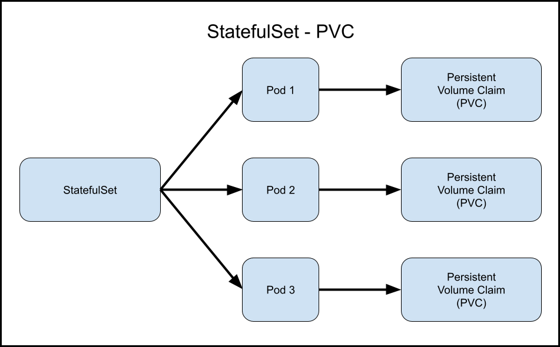
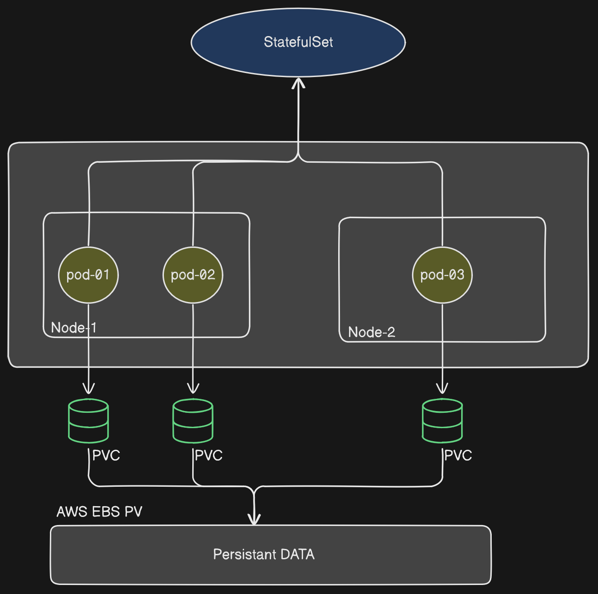

## StatefulSets vs Deployment
Kubernetes offers multiple ways to manage application workloads, including **StatefulSets** and **Deployments**. Each is designed for specific use cases and provides different functionalities. Below is a detailed comparison.

### 1. Overview

- **StatefulSet**: Manages stateful applications. Ensures that each Pod in a set has a unique, persistent identity and stable storage.
- **Deployment**: Primarily for stateless applications. Manages a set of Pods where each Pod is generally identical to any other Pod in the set.

### 2. Use Cases

- **StatefulSet**:
  - Suitable for applications requiring stable, unique network identities.
  - Used when persistent storage is required across Pod restarts.
  - Ideal for databases (e.g., MongoDB, Cassandra), distributed systems (e.g., Kafka), and applications where Pods need ordered startup/shutdown.
- **Deployment**:
  - Used for stateless applications where any Pod can handle any request.
  - Suitable for replicated services (e.g., web servers, REST APIs).
  - Typically used when Pods do not require stable network identities or storage persistence.

### 3. Pod Identity and Ordering

- **StatefulSet**:
  - Each Pod has a unique, stable network identity and hostname.
  - Pods are named sequentially (e.g., `podname-0`, `podname-1`, etc.).
  - Provides **ordered, deterministic** deployment and scaling.
- **Deployment**:
  - Pods are interchangeable, with no unique identities.
  - No guaranteed ordering during scaling up or down.
  - Pods are deployed and removed in a random order.

### 4. Storage and Persistence

- **StatefulSet**:
  - Uses PersistentVolumeClaims (PVCs) to ensure each Pod has a stable, unique storage that persists across rescheduling.
  - Each Pod can have its own PVC, ensuring persistent storage tied to the Pod’s identity.
- **Deployment**:
  - Typically does not provide persistent storage for Pods (unless used with shared PersistentVolumes).
  - Pods do not maintain unique, stable storage; volumes are usually shared among Pods if necessary.

### 5. Scaling Behavior

- **StatefulSet**:
  - Scaling is done in an ordered fashion (Pod `n+1` is only created after Pod `n` is ready).
  - Scaling down happens in reverse order, which is useful for maintaining application consistency.
- **Deployment**:
  - Pods are added or removed randomly without ordering constraints.
  - Suitable for scaling stateless applications without the need for ordered shutdown/startup.

### 6. Rolling Updates

- **StatefulSet**:
  - Supports rolling updates but with stricter controls.
  - Allows gradual updates with controlled ordering to ensure stable state across updates.
- **Deployment**:
  - Supports rolling updates by default with quicker, more flexible scaling and rollout.
  - Ideal for fast updates where application state or order is not critical.

### 7. Failover and Recovery

- **StatefulSet**:
  - Pods have stable identities, so recovery is deterministic and consistent.
  - Pods retain their identity on failover, maintaining state consistency.
- **Deployment**:
  - Any Pod can replace another upon failure, which may lead to quicker recovery for stateless apps.
  - Statelessness makes it easier to handle failure without risking data consistency.

### 8. Examples

- **StatefulSet**: Databases (MySQL, MongoDB), messaging queues (Kafka, RabbitMQ), distributed file systems (HDFS).
- **Deployment**: Web applications, API servers, microservices, load-balanced services.

### 9. Configuration Snippet

#### StatefulSet Example

```yaml
apiVersion: apps/v1
kind: StatefulSet
metadata:
  name: example-statefulset
spec:
  selector:
    matchLabels:
      app: myapp
  serviceName: "myapp-service"
  replicas: 3
  template:
    metadata:
      labels:
        app: myapp
    spec:
      containers:
      - name: myapp-container
        image: myapp-image
        volumeMounts:
        - name: myapp-storage
          mountPath: "/data"
  volumeClaimTemplates:
  - metadata:
      name: myapp-storage
    spec:
      accessModes: [ "ReadWriteOnce" ]
      storageClassName: "standard"
      resources:
        requests:
          storage: 1Gi
```
#### Deployment Example
```yml
apiVersion: apps/v1
kind: Deployment
metadata:
  name: example-deployment
spec:
  replicas: 3
  selector:
    matchLabels:
      app: myapp
  template:
    metadata:
      labels:
        app: myapp
    spec:
      containers:
      - name: myapp-container
        image: myapp-image
        ports:
        - containerPort: 80
```

# [PersistentVolume (PV) Provisioning](https://github.com/kubernetes/examples/blob/master/staging/persistent-volume-provisioning/README.md)

- A PersistentVolume is a piece of storage in the Kubernetes cluster that has been *provisioned by an administrator* or *dynamically using StorageClasses*.
- The admin must define StorageClass objects that describe named "classes" of storage offered in a cluster.
- When configuring a StorageClass object for persistent volume provisioning, the admin will need to describe the type of **provisioner** to use and the **parameters** that will be used by the provisioner when it provisions a PersistentVolume belonging to the class.
- The provisioner field must be specified as it determines what `volume plugin` is used for provisioning PVs.
- The parameters field contains the parameters that describe volumes belonging to the storage class. Different parameters may be accepted *depending on the provisioner*.

**Key Attributes:**
  - **Capacity**: The size of the storage.
  - **Access Modes**: Defines how the volume can be mounted (e.g., ReadWriteOnce, ReadOnlyMany, ReadWriteMany).
  - **Reclaim Policy**: Determines what happens to the PV after the PVC is deleted (e.g., Retain, Recycle, Delete).
  - **StorageClass**: Links the PV to a StorageClass for dynamic provisioning.

AWS EBS PV
```yml
apiVersion: storage.k8s.io/v1
kind: StorageClass
metadata:
  name: ebs-sc
provisioner: ebs.csi.aws.com
volumeBindingMode: WaitForFirstConsumer
parameters:
  csi.storage.k8s.io/fstype: xfs
  type: io1
  iopsPerGB: "50"
  encrypted: "true"
allowedTopologies:
- matchLabelExpressions:
  - key: topology.ebs.csi.aws.com/zone
    values:
    - us-east-2c
```
```yml
---
apiVersion: v1
kind: PersistantVolume
metadata:
  name: example-volume
  labels:
    type: local
spec:
  storageClassName: ebs-sc
  capacity: 
    storage: 50Gi
  accessModes:
    - ReadWriteOnce
  hostpath:
    path: "/mnt/data"
```

********PersistantVolume without StorageClass.********
```yml
apiVersion: v1
kind: PersistentVolume
metadata:
  name: my-manual-pv
spec:
  capacity:
    storage: 5Gi
  volumeMode: Filesystem
  accessModes:
    - ReadWriteOnce
  persistentVolumeReclaimPolicy: Retain
  nfs:
    server: nfs-server.default.svc.cluster.local
    path: "/path/to/data"
```


# PersistentVolumeClaim (PVC)

- A PersistentVolumeClaim is a request for storage by a user. It specifies size, access modes, and optionally, a StorageClass. Kubernetes matches PVCs to PVs based on these specifications

**Key Attributes**:
1. **Requested Storage**: The size of the storage needed.
2. **Access Modes**: How the storage should be accessed.
3. **StorageClass**: (Optional) Specifies the desired StorageClass for dynamic provisioning.

```yml
apiVersion: v1
kind: PersistentVolumeClaim
metadata:
  name: pvc-example
spec:
  accessModes:
    - ReadWriteOnce
  resources:
    requests:
      storage: 5Gi
  storageClassName: ebs-sc # Optinal
```


*how to use PVC inside the POD defination*

```yml
apiVersion: v1
kind: Pod
metadata:
  name: my-pod
spec:
  containers:
  - name: my-container
    image: nginx
    
    # This subsection defines how volumes are mounted into the container.
    volumeMounts: 
    
    # mount name
    - name: my-storage 
    
      # Mount Path inside container
      mountPath: "/usr/share/nginx/html" 
  volumes:
  - name: my-storage
    persistentVolumeClaim:
      claimName: my-manual-pvc
```

# [StorageClass](https://kubernetes.io/docs/concepts/storage/storage-classes/)

- A StorageClass provides a way to describe the "classes" of storage available in a Kubernetes cluster. 
- If you are leveraging dynamic provisioning, you should create the StorageClass first. This is because the StorageClass is responsible for dynamically provisioning the PersistentVolumes when a PersistentVolumeClaim (PVC) is created.
- A StorageClass provides a way for administrators to describe the classes of storage they offer
- It abstracts the underlying storage provider (like AWS EBS, GCE PD, NFS, etc.) and allows dynamic provisioning of PVs.

**Key Attributes**:
  1. **Provisioner**: Specifies the volume plugin (e.g., kubernetes.io/aws-ebs, kubernetes.io/gce-pd, kubernetes.io/nfs).
  2. **Parameters**: Configuration options specific to the provisioner.
  3. **Reclaim Policy**: Defaults for dynamically provisioned PVs.

```yml
apiVersion: storage.k8s.io/v1
kind: StorageClass
metadata:
  name: ebs-sc
provisioner: kubernetes.io/aws-ebs
parameters:
  type: gp2
  zones: us-east-1a,us-east-1b
reclaimPolicy: Retain
```

**Workflow**:

  - **Create the StorageClass**: Define the storage characteristics and provisioner.
  - **Create the PVC**: Reference the StorageClass in the PVC specification.
  - **Kubernetes Automatically Creates the PV**: Kubernetes uses the provisioner to create the storge.

### Static vs Dynamic provisioning of PV in K8s

1. **Dynamic Provisioning**
- **StorageClass First**: If you're using dynamic provisioning, you should create the StorageClass first. This is because when a PersistentVolumeClaim (PVC) is created with a storageClassName, Kubernetes uses the StorageClass to dynamically provision a PersistentVolume that matches the PVC's requirements.
- **PVC Creation Triggers PV Creation**: After the StorageClass is defined, the PVC can be created. Kubernetes will then automatically create a PV based on the specifications in the StorageClass and bind it to the PVC.

**Order**:
  - StorageClass
  -  PersistentVolumeClaim (PVC)


2. **Static Provisioning**
- **PersistentVolume First**: In the case of static provisioning, you manually create the PVs first. These PVs are pre-provisioned by an administrator and are available in the cluster for any PVC to claim.
- **PVC Creation Binds to PV**: After the PVs are created, you can create PVCs that match the specifications of the available PVs. Kubernetes will bind the PVC to a matching PV.

**Order**:
  - PersistentVolume (PV)
  - PersistentVolumeClaim (PVC)
---

## Imperative Commands to find pods with selected Labels

`kubectl get pods --selector key=value --no-headers | wc -l`

`kubectl get pods --selector env=prod,env=prod,tier=frontend`

# [Taints and Tolerence](https://kubernetes.io/docs/concepts/scheduling-eviction/taint-and-toleration/)

- Taints are placed on Nodes
- Tolerations is placed on Pods
- Tolerations allow the scheduler to schedule pods with matching taints.
- if Taint are placed on the specific node it will not allow a pod without tolerence tobe scheduled on that Node
- if we place the tolerence on the specific pod then only it will be able to scheduled on the node else not
- Taints are the opposite -- they allow a node to repel a set of pods.
- Taints and tolerations work together to ensure that pods are not scheduled onto **inappropriate** nodes.
- One or more taints are applied to a node; this marks that the node should not accept any pods that do not tolerate the taints
- Taints and Tolerations does not tell pod to go on specific node
- *Taints and Tolerations only tells accept pods on the node with certain tolerations.*
- if you want to restrict a certain pod on a single node then you have to use the node **Affinity**.
- Taint is alredy placed on masterNode which tells the scduler not to schedule pods on the masterNode to view which taint effect is applied on the master node use below command.
  - `kubectl describe node kubemaster | grep Taint`

## Taint-Effects

- **NoExecute**
  - Pods that do not tolerate the taint are evicted immediately
  - Pods that tolerate the taint without specifying `tolerationSeconds` in their toleration specification remain bound forever
  - Pods that tolerate the taint with a specified `tolerationSeconds` remain bound for the specified amount of time. After that time elapses, the node lifecycle controller evicts the Pods from the node
  - Pods currently running on the node are **evicted** if does not match the tolerence.
  - `NoExecute` effect can specify an optional `tolerationSeconds` field that dictates how long the pod will stay bound to the node after the taint is added
- **NoSchedule**
  - No new Pods will be scheduled on the tainted node unless they have a matching toleration. Pods currently running on the node are not evicted.
- **PreferNoSchedule**
  - `PreferNoSchedule` is a "preference" or "soft" version of `NoSchedule`.
  - The control plane will try to avoid placing a Pod that does not tolerate the taint on the node, *but it is not guaranteed*.

---

### Commands: (Applying Tolerence to Node:)

To Apply the Taint on the Node

`kubectl taint nodes node1 key1=value1:NoSchedule`

To  remove the taint from the node:

`kubectl taint nodes node1 key1=value1:NoSchedule-`

```
kubectl taint nodes node1 key1=value1:NoSchedule
kubectl taint nodes node1 key1=value1:NoExecute
kubectl taint nodes node1 key2=value2:NoSchedule
```

### Applying Tolerence to Pod

```yml
apiVersion: v1
kind: Pod
metadata:
  name: nginx
  labels:
      env: test
spec:
  containers:
  - name: nginx
    image: nginx
    imagePullPolicy: IfNotPresent

# add tolerence to Pod
  tolerations:
  - key: "key1"
    operator: "Equal"
    value: "value1"
    effect: "NoSchedule"
```

---

# [Node Selectors](https://kubernetes.io/docs/concepts/scheduling-eviction/assign-pod-node/)

- Node selectors helps in scheduling the pod on specific node based on labels assigned to node and the pods
- suppose we have Three nodes namely Large, Small with labels as size = large/small.
- We can use this label information to schedule our pods accordingly.

Example :

```yml
apiVersion: v1
kind: Pod
metadata:
  name: nginx
  labels:
      env: test
spec:
  containers:
  - name: nginx
    image: nginx

# Apply node selector to run pod on node with size=large label on it
  nodeSelector:
    size: large
```

## Commands

Add a label to a particular node

`kubectl label nodes <node_name> key=value`

### Limitations
>
> NodeSelector will not be able to help in complex senerios such as
>
> - size=large or size=small
> - size !=medium (not equal)

---

# [Node Affinity](https://kubernetes.io/docs/tasks/configure-pod-container/assign-pods-nodes-using-node-affinity/)

- with the help of Node Affinity , you can control the scheduling of pods  onto nodes more granularly using various criteria like
- It is an extension of node selectors which allows you to specify more flexible rules about where to place your pods by specifying certain requirements.

Example: This manifest describes a Pod that has a `requiredDuringSchedulingIgnoredDuringExecution` node affinity,`size=large or size=small`. This means that the pod will get scheduled only on a node that has a `size=large or size=small`

```yml
apiVersion: v1
kind: Pod
metadata:
  name: nginx
spec:
  affinity:
    nodeAffinity:
      requiredDuringSchedulingIgnoredDuringExecution:
        nodeSelectorTerms:
        - matchExpressions:
          - key: size
            operator: In
            values: # The Pod will scheduled on the nodes that have at least one of these value.
            - large
            - small            
  containers:
  - name: nginx
    image: nginx
    imagePullPolicy: IfNotPresent
```

## Node Affinity types

1. **`required`DuringScheduling`Ignored`DuringExecution**
     - Pods with this affinity rule will only be scheduled on nodes that meet the specified requirements. However, if a node loses the label that made it eligible after the pod is scheduled, the pod will still continue to run on that node.
2. **`Preferred`DuringScheduling`Ignored`DuringExecution**
     - Pods with this affinity rule will prefer to be scheduled on nodes that meet the specified requirements, but they are not strictly required to. If no nodes match the preferred requirements, the pod can still be scheduled on other nodes.
  
| Syntax | DuringScheduling | DuringExecution |
| ----------- | ----------- | --------------- |
| Type1 | Required | Ignored |
| Type2 | preferred | Ignored |
| Type3 | Required | Required |

### Taints and Tolerence & Node Affinity

- You can use both  taints and tolerations & Node affinity to granular control over the Pod scheduling on the specific nodes.

- **what if we applied taint to specific node and Node Affinity to a pod to be schedule on the specific node only without tolerance set what will happen?**
  - When the scheduler attempts to place the pod onto a node, it evaluates the Node Affinity rules against the labels of each node in the cluster.
  - If there is a node that meets the Node Affinity requirements specified in the pod's configuration and doesn't have a taint that repels the pod (i.e., the node matches the Node Affinity and doesn't have any taints), the pod will be scheduled on that node.
  - However, if the node with the matching Node Affinity also has the taint that the pod lacks tolerations for, the pod won't be scheduled on that node due to the taint-repelling behavior. In this case, the pod won't be scheduled anywhere unless there is another node in the cluster that meets the Node Affinity requirements and doesn't have the taint applied.

---

# [Resource Requests and Limits](https://kubernetes.io/docs/concepts/configuration/manage-resources-containers/)

- **Requests**: Requests specify the minimum amount of resources (CPU and memory) that a pod needs to run.
  - When a pod is scheduled onto a node, Kubernetes ensures that the node has enough available resources to satisfy the pod's resource requests.
  - Requests are used by the **scheduler** to determine the best node for placing a pod.

- **Limits**: Limits, on the other hand, specify the maximum amount of resources that a pod can consume.
  - Kubernetes enforces these limits to prevent pods from using more resources than allowed, which helps in maintaining stability and preventing resource contention.
  - If a pod exceeds its specified limits, Kubernetes may take actions such as throttling or terminating the pod.
  - Pod cannot exceed the CPU limit but can exceed the Memory Limit in that case K8s will try to Terminate or kill the Pod when it finds that the pod is using more resources than allowed `OOM` (out of memory (OOM) error) `OOMKilled` means the pod has been killed by Out of Memory.
  - if you donot specify the Request the Limit will be `Request = Limit`

## Use Cases

1. **No Request and No Limit**

- This scenario is suitable for non-critical applications or experiments where resource requirements are flexible, and the pod can utilize whatever resources are available on the node without any constraints. However, it can lead to potential resource contention issues if other pods on the node require resources.

2. **No Request and Limit**

- This scenario is useful when you want to constrain the resource usage of a pod to prevent it from using excessive resources and impacting other pods on the node. However, without a request, Kubernetes scheduler may place the pod on a node without considering its resource needs, potentially leading to inefficient resource allocation.

3. **Request and Limit**

- This is the most common and recommended configuration. By specifying both requests and limits, Kubernetes can ensure that the pod gets scheduled on a node with sufficient resources and enforce resource constraints to maintain stability and fairness within the cluster.

4. **Request and No Limits**

- This scenario is suitable when you want to ensure that the pod gets scheduled on a node with sufficient resources based on its requirements, but you're not concerned about limiting its resource usage. It allows the pod to scale up its resource consumption based on demand without strict constraints, which can be useful for certain workloads with variable resource requirements.

---

```yml
---
apiVersion: v1
kind: Pod
metadata:
  name: frontend
spec:
  containers:
  - name: app
    image: images.my-company.example/app:v4
    resources:
      requests:
        memory: "64Mi"
        cpu: "1"
      limits:
        memory: "128Mi"
        cpu: "500m"
```

**Note**:
>Kubernetes doesn't allow you to specify CPU resources with a precision finer than `1m or 0.001 CPU`. To avoid accidentally using an invalid CPU quantity, it's useful to specify CPU units using the milliCPU form instead of the decimal form when using less than `1 CPU` unit.
>For example, you have a Pod that uses `5m or 0.005 CPU` and would like to decrease its CPU resources. By using the decimal form, it's harder to spot that `0.0005 CPU` is an invalid value, while by using the milliCPU form, it's easier to spot that `0.5m` is an invalid value.
>Limits and requests for `memory` are measured in bytes. You can express memory as a plain integer or as a fixed-point number using one of these quantity suffixes: E, P, T, G, M, k. You can also use the power-of-two equivalents: Ei, Pi, Ti, Gi, Mi, Ki. For example, the following represent roughly the same value:
  `128974848, 129e6, 129M,  128974848000m, 123Mi`
>Pay attention to the case of the suffixes. If you request `400m` of memory, this is a request for 0.4 bytes. Someone who types that probably meant to ask for 400 mebibytes (`400Mi`) or 400 megabytes (`400M`).
---

# [DeamonSet](https://kubernetes.io/docs/concepts/workloads/controllers/daemonset/)

- DeamonSet are simillar to ReplicaSets but inly difference is that DeamonSet ensure that every node has at  least one instance of a pod running.
- when the node gets created DeamonSet automatically creates the pod on the Node.
- Pods created by the DeamonSet are ignored by the Kube-scheduler.
- deamonSets does not support scalling inside the Node
- it supports the Rolling update like Deployments.

## Use Cases

  - running a cluster storage daemon on every node
  - running a *logs collection* daemon on every node
  - running a *node monitoring* daemon on every node
- one DaemonSet, covering all nodes, would be used for each type of daemon.
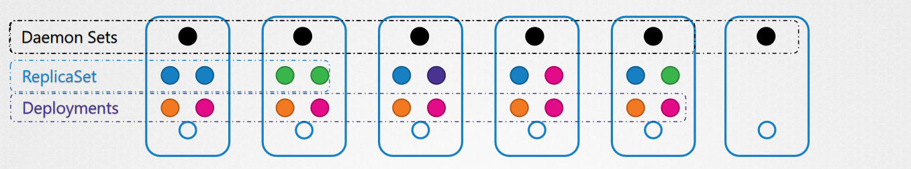

```yml
apiVersion: apps/v1
kind: DaemonSet
metadata:
  name: fluentd-elasticsearch
  namespace: kube-system
  labels:
    k8s-app: fluentd-logging
spec:
  selector:
    matchLabels:
      name: fluentd-elasticsearch
  template:
    metadata:
      labels:
        name: fluentd-elasticsearch
    spec:
      tolerations:
      # these tolerations are to have the daemonset runnable on control plane nodes
      # remove them if your control plane nodes should not run pods
      - key: node-role.kubernetes.io/control-plane
        operator: Exists
        effect: NoSchedule
      - key: node-role.kubernetes.io/master
        operator: Exists
        effect: NoSchedule
      containers:
      - name: fluentd-elasticsearch
        image: quay.io/fluentd_elasticsearch/fluentd:v2.5.2
        resources:
          limits:
            memory: 200Mi
          requests:
            cpu: 100m
            memory: 200Mi
        volumeMounts:
        - name: varlog
          mountPath: /var/log
      # it may be desirable to set a high priority class to ensure that a DaemonSet Pod
      # preempts running Pods
      # priorityClassName: important
      terminationGracePeriodSeconds: 30
      volumes:
      - name: varlog
        hostPath:
          path: /var/log
```

`kubectl apply -f DeamonSet.yml`

## Running Pods on select Nodes
>
>If you specify a `.spec.template.spec.nodeSelector`, then the DaemonSet controller will create Pods on nodes which match that **node selector**. Likewise if you specify a `.spec.template.spec.affinity`, then DaemonSet controller will create Pods on nodes which match that **node affinity**. If you do not specify either, then the DaemonSet controller will create Pods on all nodes.
---

# [Static Pods](https://kubernetes.io/docs/tasks/configure-pod-container/static-pod/)

- Static Pods are managed directly by the **kubelet daemon** on a specific node, without the API server observing them.
- kube-Scheduler ignore the Static pods
- Static pod are used to depoly the Control plane pods
- static pods are only created by kubelet.
- Static Pods are always bound to one Kubelet on a specific node.
- to Identify the Static pods, they always have a nodeName at the end. ex- **etcd-`controlplane`**, **kube-apiserver-`controlplane`**, **kube-controller-manager-`controlplane`**, **kube-scheduler-`controlplane`** or you can refer to the `OwerReference`in the Pod defination file.
- Kubelet does not manage the Deployment and Replicasset it only manages the Pod
- Static pods are visible to the Kube-Apiserver, but does not control from there
- Kubelet also runs on the master node in Kubernetes to provision the master components as static pods.
  
**There are two way to craete a Static pod**

1. **Filesystem-hosted static Pod manifest**
2. **Web-hosted static pod manifest**

- Manifests are standard Pod definitions in JSON or YAML format in a specific directory. Use the `staticPodPath: <the directory>` field in the [kubelet configuration file](https://kubernetes.io/docs/reference/config-api/kubelet-config.v1beta1/), which periodically scans the directory and creates/deletes static Pods as YAML/JSON files **appear/disappear there**.
- to modify the kubelet use the [`KubeletConfiguration`](https://kubernetes.io/docs/tasks/administer-cluster/kubelet-config-file/) YAML file which is the recommended way.

```yml
apiVersion: kubelet.config.k8s.io/v1beta1
kind: KubeletConfiguration
address: "192.168.0.8"
port: 20250
serializeImagePulls: false
evictionHard:
    memory.available:  "100Mi"
    nodefs.available:  "10%"
    nodefs.inodesFree: "5%"
    imagefs.available: "15%"
    staticPodPath: "/etc/kubernetes/manifests"
```

to apply this file

`kubectl apply -f kubelet-config.yaml`

- `staticPodPath: "/etc/kubernetes/manifests"` is were the static-pod manifest are stored this path is not same always *refer the kubelet config file for the mention path*
  - `cat /var/lib/kubelet/config.yaml` look for `staticPodPath`

  or

- `--pod-manifest-path=/etc/kubernetes/manifests/` **(command line method for creating the static pod)**
  - `systemctl restart kubelet`
- `kubectl run --restart=Never --image=busybox static-busybox --dry-run=client -o yaml --command -- sleep 1000 > /etc/kubernetes/manifests/static-busybox.yaml`

```shell
controlplane ~ ➜  ls -lrt /etc/kubernetes/manifests/
total 16
-rw------- 1 root root 2406 Apr  7 16:35 etcd.yaml
-rw------- 1 root root 1463 Apr  7 16:35 kube-scheduler.yaml
-rw------- 1 root root 3393 Apr  7 16:35 kube-controller-manager.yaml
-rw------- 1 root root 3882 Apr  7 16:35 kube-apiserver.yaml
```

- to ssh into any node within k8s cluster you can use the command `ssh <Node-name>/<Node-IP>`

# [Multiple Schedulers](https://kubernetes.io/docs/tasks/extend-kubernetes/configure-multiple-schedulers/)

- K8s comes with a single default scheduler but as the k8s is highly extensible, If the default scheduler does not suit your needs you can **implement your own scheduler**.
- you can even run multiple schedulers simultaneously alongside the default scheduler.

---
**STEP 1:**

- Package your scheduler binary into a container image.
- Clone the [Kubernetes](https://github.com/kubernetes/kubernetes.git) source code from GitHub and build the source.
- `Docker Build -t` and `Docker Push` to push the Image to Docker Hub (or another registry). refer k8s documentation

---
**Docker File**

```Dockerfile
FROM busybox
ADD ./_output/local/bin/linux/amd64/kube-scheduler /usr/local/bin/kube-scheduler
```

---
**STEP 2:** Define a Kubernetes Deployment for the scheduler

- you have your scheduler in a container image
- create a pod/Deployment configuration for it and run it in your Kubernetes cluster.
- Save it as [my-scheduler.yaml](https://raw.githubusercontent.com/kubernetes/website/main/content/en/examples/admin/sched/my-scheduler.yaml)
- in the deployment use this

```yml
---
# **my-scheduler-config.yaml**
apiVersion: kubescheduler.config.k8s.io/v1
kind: KubeSchedulerConfiguration
profiles:
  - schedulerName: my-scheduler
leaderElection:
  leaderElect: false 

---
# **my-scheduler-configmap.yaml**
apiVersion: v1
data:
  my-scheduler-config.yaml: |
    apiVersion: kubescheduler.config.k8s.io/v1
    kind: KubeSchedulerConfiguration
    profiles:
      - schedulerName: my-scheduler
    leaderElection:
      leaderElect: false
kind: ConfigMap
metadata:
  creationTimestamp: null
  name: my-scheduler-config
  namespace: kube-system   

---
# **my-scheduler.yml**
apiVersion: v1
kind: Pod
metadata:
  labels:
    run: my-scheduler
  name: my-scheduler
  namespace: kube-system
spec:
  serviceAccountName: my-scheduler
  containers:
  - command:
    - /usr/local/bin/kube-scheduler
    - --config=/etc/kubernetes/my-scheduler/my-scheduler-config.yaml
    image: registry.k8s.io/kube-scheduler:v1.29.0
    livenessProbe:
      httpGet:
        path: /healthz
        port: 10259
        scheme: HTTPS
      initialDelaySeconds: 15
    name: kube-second-scheduler
    readinessProbe:
      httpGet:
        path: /healthz
        port: 10259
        scheme: HTTPS
    resources:
      requests:
        cpu: '0.1'
    securityContext:
      privileged: false
    volumeMounts:
      - name: config-volume
        mountPath: /etc/kubernetes/my-scheduler
  hostNetwork: false
  hostPID: false
  volumes:
    - name: config-volume
      configMap:
        name: my-scheduler-config
```yml

---
**STEP 3:** How to use the custom schduler into pod definations.

```yml
---
apiVersion: v1
kind: Pod
metadata:
  name: frontend
spec:
  containers:
  - name: nginx
    image: nginx
  
  # This is how you can add the custom scheduler to pod.
  schedulerName: my-scheduler
```yml

**Example**:

```
controlplane ~ ➜  kubectl get pods -A
NAMESPACE      NAME                                   READY   STATUS    RESTARTS   AGE
kube-flannel   kube-flannel-ds-nssdp                  1/1     Running   0          10m
kube-system    coredns-69f9c977-25wxh                 1/1     Running   0          10m
kube-system    coredns-69f9c977-9v84m                 1/1     Running   0          10m
kube-system    etcd-controlplane                      1/1     Running   0          11m
kube-system    kube-apiserver-controlplane            1/1     Running   0          11m
kube-system    kube-controller-manager-controlplane   1/1     Running   0          10m
kube-system    kube-proxy-zhj22                       1/1     Running   0          10m
kube-system    kube-scheduler-controlplane            1/1     Running   0          10m
kube-system    **my-scheduler**                           1/1     Running   0          2m22s
```

---
`kubectl get events -o wide`

`kubectl logs <scheduler_name> -n <name_space>`

---

# [Scheduler Profiles](https://kubernetes.io/docs/concepts/scheduling-eviction/pod-priority-preemption/)

- Suppose if you have multiple schedulers you can combine all those schedulers to use same binary rather than creating multiple binaries, this can be achived with the help of Scheduler Profile in latest k8s versions.
- this is a efficient way to use and configure mutiple schedulers in k8s cluster.
- How a Pod gets scheduled on the nodes
  - **Sceduling Queue**
  - **Filtering**
  - **Scoring**
  - **Binding**

 Practice Exam Tests.png>)

## Scheduling Queue

### PriorityClass

- you can set the priority of pod tobe scheduled

```yml
---
apiVersion: scheduling.k8s.io/v1
kind: PriorityClass
metadata:
  name: high-priority
value: 1000000
globalDefault: false
description: "This priority class should be used for XYZ service pods only."

---
apiVersion: v1
kind: Pod
metadata:
  name: frontend
spec:
  priorityClass: high-priority
  containers:
  - name: nginx
    image: nginx
  resources:
    requests:
      memory: 1Gi
      cpu: 10
```

## [Filtering](https://kubernetes.io/docs/concepts/scheduling-eviction/kube-scheduler/#kube-scheduler-implementation)

- Filter which nodes are not  suitable for running the pod, e.g., lack of resource or taints and tolerations

## [Scoring](https://discuss.kubernetes.io/t/kube-pod-scoring-criteria/20743)

- after the filtering phase Nodes which are eligible will go through the scoring phase . The node with the highest score is selected.
- Score means Suitable to run the Pod and have more available free resource after scheduling.
- The scheduler assigns a score to each Node that survived filtering, basing this score on the active scoring rules.

## Binding

- The nodes which have a good score are selected for binding.

### [Sceduler Plugins](https://kubernetes.io/docs/concepts/scheduling-eviction/scheduling-framework/#interfaces)

- **Scheduling Queue**
  - PrioritySort
- **Filtering**
  - NodeResourcesFit
  - NodeName
  - NodeUnschedule
- **Scoring**
  - NodeResourcesFit
  - ImageLocality
- **Binding**
  - DefaultBinder

These Plugins are pluged to **Extention points**

1. queueSort
2. filter
3. score
4. bind

---

# [Logging and Monitoring the Kubernetes Components:](https://kubernetes.io/docs/tasks/debug/)

## Monitoring The k8s Cluster

- `Metric Server` is available on each node to gather logs.
- Metric server can be enabled using `minikube addons enable metrics-server` on minikube only
- for Others to deploy **metric server**
  - `git clone https://github.com/kubernetes-incubator/metrics-server.git`
  - `kubectl create -f deploy/1.8+/`
  - `kubectl top node` to view resource consumption of cluster.

```
controlplane kubernetes-metrics-server on  master ➜  kubectl top node
NAME           CPU(cores)   CPU%   MEMORY(bytes)   MEMORY%   
controlplane   258m         0%     1084Mi          0%        
node01         118m         0%     268Mi           0%        
```

- `kubectl top pod` to view resources consumption of pods.

```
controlplane kubernetes-metrics-server on  master ➜  kubectl top pod
NAME       CPU(cores)   MEMORY(bytes)   
elephant   15m          32Mi            
lion       1m           18Mi            
rabbit     102m         14Mi            
```

## Logging in K8s

- to view logs of a pod
  - `kubectl logs <pod-name>`
- to view logs of a pod in a specific container
  - `kubectl logs <pod-name> -c <container-name>`
- to view logs of a pod in a specific container and follow the logs
- `kubectl describe pod` to find the container name

```
Name:         my-pod
Namespace:    default
Priority:     0
Node:         node1/10.0.0.1
Start Time:   Tue, 01 Mar 2023 10:00:00 +0000
Labels:       app=my-app
Annotations:  <none>
Status:       Running
IP:           10.0.0.2
IPs:
  IP:  10.0.0.2
Containers:
  **my-container:** 
    Container ID:   docker://abcdefg1234567890
    Image:          my-image:latest
    Image ID:       docker-pullable://my-image@sha256:abcdefg1234567890
    Port:           8080/TCP
    Host Port:      0/TCP
    State:          Running
      Started:      Tue, 01 Mar 2023 10:00:01 +0000

```

# Application Lifecycle Management in K8s

## Rollout and Versioning

- Users expect applications to be available all the time, and developers are expected to deploy new versions of them several times a day. In Kubernetes this is done with rolling updates
- A **rollinrg update** allows a Deployment update to take place with **zero downtime**
- It does this by incrementally replacing the current Pods with new ones.
- Kubernetes waits for those new Pods to start before removing the old Pods.
- In Kubernetes, updates are versioned and any Deployment update can be reverted to a previous (stable) version.
- the Service will load-balance the traffic only to available Pods during the update.
- when updates happens the new set of replicas are created one by one and the old set of replicas are down to 0 one by one in **rolling update**. when doing the undo old ones are up and new ones are down to zero one by one.

```
> kubectl get replicasets
NAME DESIRED CURRENT READY AGE
myapp-deployment-67c749c58c 0 0 0 22m
myapp-deployment-7d57dbdb8d 5 5 5 20m
```

**Rolling updates allow the following actions:**

1. Promote an application from one environment to another (via container image updates)
2. Rollback to previous versions
3. Continuous Integration and Continuous Delivery of applications with zero downtime

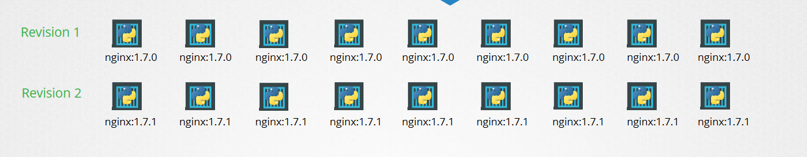

to update the image

- `kubectl set image deployment/<deployment-name> <container-name>=<new-image>`

To view the status of application upgrade

- `kubectl rollout status deployment/<deployment-name>`

```
> kubectl rollout status deployment/myapp-deployment
Waiting for rollout to finish: 0 of 10 updated replicas are available...
Waiting for rollout to finish: 1 of 10 updated replicas are available...
Waiting for rollout to finish: 2 of 10 updated replicas are available...
Waiting for rollout to finish: 3 of 10 updated replicas are available...
Waiting for rollout to finish: 4 of 10 updated replicas are available...
Waiting for rollout to finish: 5 of 10 updated replicas are available...
Waiting for rollout to finish: 6 of 10 updated replicas are available...
Waiting for rollout to finish: 7 of 10 updated replicas are available...
Waiting for rollout to finish: 8 of 10 updated replicas are available...
Waiting for rollout to finish: 9 of 10 updated replicas are available...
deployment "myapp-deployment" successfully rolled out
```

To view the history of application upgrade

- `kubectl rollout history deployment/<deployment-name>`

```
> kubectl rollout history deployment/myapp-deployment
deployments "myapp-deployment"
REVISION CHANGE-CAUSE
1        <none>
2        kubectl apply --filename=deployment-definition.yml --record=true
```

To rollback to a previous version

- `kubectl rollout undo deployment/<deployment-name>`

## Deployment Strategy

- The Deployment controller supports two different strategies for rolling updates:

1. **Recreate**
   - In this strategy, all existing Pods are killed one at a time, and new ones are created to replace them.
   - In the strategy user will faces the downtime of application during the update.

2. **Rolling Update**
   - In this strategy, new Pods are created and the old ones are killed one at a time.
   - In this strategy, user will not faces the downtime of application during the update.

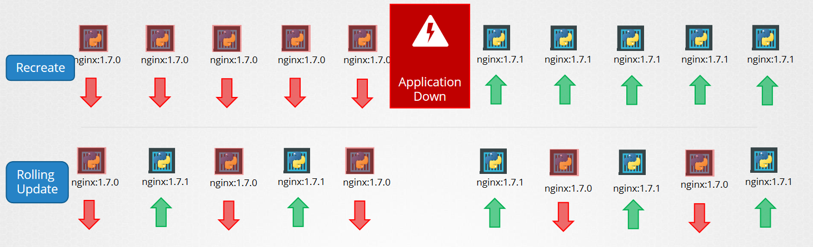

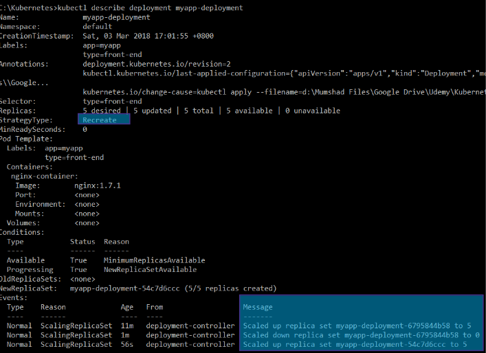  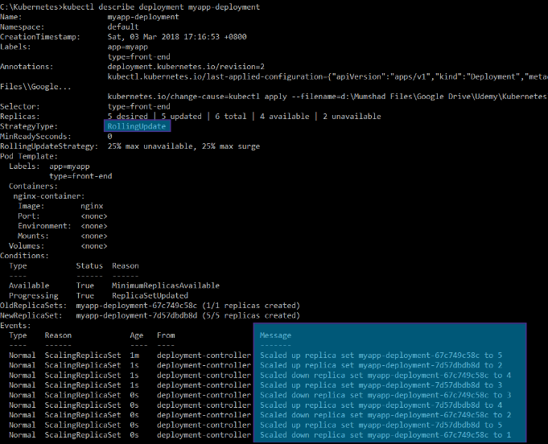

There are two ways to update the deployment

1. **Manually**
   - The user can manually update the deployment by changing the image version in the deployment manifest. `kubectl edit deployment <deployment-name>`
   - or using commandline `kubectl set image deployment/<deployment-name> <container-name>=<new-image-name>`

2. **Automatically**
   - The user can also update the deployment automatically by using the image update policy.

## Application Commands, EntryPoint and Arguments in Pod defination

### Docker

Difference Between `ENTRYPOINT` and `CMD` in Docker and use case.

- **`CMD`** is used to run the command when the container is started.
  - The `CMD` instruction specifies the default command or arguments that will be executed by the ENTRYPOINT if no other command is provided when running the container.
  - If you use both `ENTRYPOINT` and `CMD` in a Dockerfile, the CMD instruction will provide the default arguments for the `ENTRYPOINT`.
- **`ENTRYPOINT`** is used to run the command when the container is started.
  - It is the preferred way to define the main command for a Docker container.
  - If you provide additional arguments when running the container, they will be appended to the `ENTRYPOINT` instruction.
  - The ENTRYPOINT cannot be overridden by arguments provided during container runtime unless you use the `--entrypoint` flag.

Command:
`docker run ubuntu [COMMAND]`

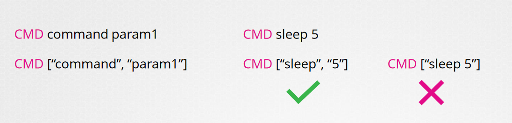

**Example:**

1.

```
# Example 1: Using ENTRYPOINT
FROM ubuntu
ENTRYPOINT ["sleep"]

# If you run: docker run my-image 10
# It will execute: sleep 10

# If you run: docker run my-image sleep2.0 10
# It willnot execute: sleep 10 (cannot replace sleep the default ENTRYPOINT) need to use `--entrypoint sleep2.0` to replace it in commandline

```

`docker run --entrypoint sleep2.0 my-image 10`

2.

```
# Example 2: Using CMD
FROM ubuntu
CMD ["sleep", "5"]

# If you run: docker run my-image
# It will execute: sleep 5

# If you run: docker run my-image 10
# It will execute: sleep 10 (overriding the default CMD)

# If you run: docker run my-image sleep2.0 10
# It will execute: sleep2.0 10 (replace the default CMD)

```

3.

```
# Example 3: Using ENTRYPOINT and CMD together
FROM ubuntu
ENTRYPOINT ["sleep"]
CMD ["5"]

# If you run: docker run my-image
# It will execute: sleep 5 (CMD provides the default argument)

# If you run: docker run my-image 10
# It will execute: sleep 10 (additional arguments are appended)
```

### POD

- we can use `command` to override the `ENTRYPOINT` from pod defination,works like `--entrypoint`
- we can use `args` to override the `CMD` from pod defination

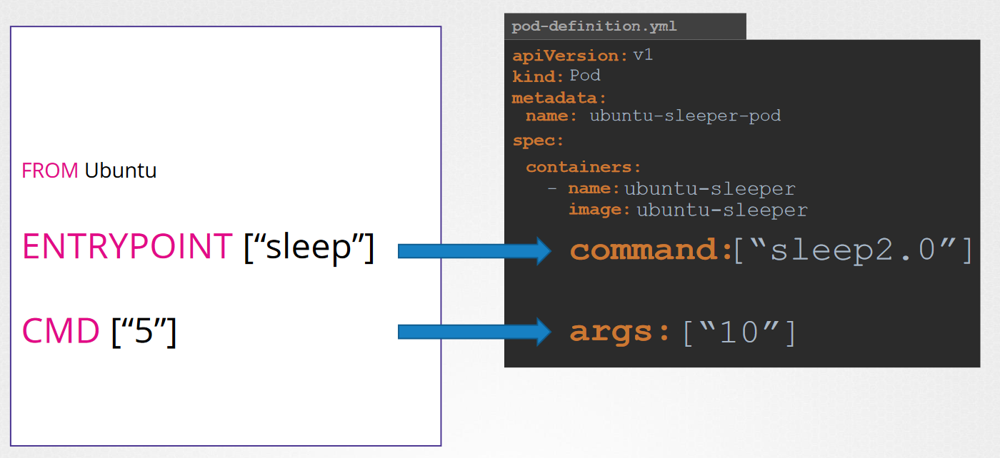

Example 1 of `Command` and `args`

```
---
apiVersion: v1
kind: Pod
metadata:
  name: frontend
spec:
  priorityClass: high-priority
  containers:
  - name: nginx
    image: nginx
    command: ["sleep", "5000"]
# OR
    command:
    - "sleep"
    - "5000"
```

Example 2 of `Command` and `args`

```yml
---
apiVersion: v1
kind: Pod
metadata:
  name: frontend
spec:
  priorityClass: high-priority
  containers:
  - name: nginx
    image: nginx
    command: ["sleep"]
    args: ["5000"]
```

>**Note**:
> Both the `command` and `args` need to string not number

# [Config Map](ConfigMaps)

## What is a ConfigMap

- ConfigMap can pass the key value pair to the pod
- ConfigMap can be used to pass the configuration to the pod
- it helps in managing the environment variables in the pod defination centrally
- A ConfigMap is an API object used to store non-confidential data in key-value pairs
- Pods can consume ConfigMaps as environment variables, command-line arguments, or as configuration files in a volume.
- The Pod and the ConfigMap must be in the same namespace.
- ConfigMap does not provide secrecy or encryption
- A ConfigMap allows you to decouple environment-specific configuration from your container images, so that your applications are easily portable.'
- a ConfigMap has `data` and `binaryData` fields rather than spec.
- The data field is designed to contain `UTF-8` strings while the binaryData field is designed to contain binary data as `base64-encoded` strings.
- **The Kubernetes feature `Immutable` Secrets and ConfigMaps provides an option to set individual Secrets and ConfigMaps as immutable**.
  - protects you from **accidental** (or unwanted) updates that could cause applications outages
  - **improves performance** of your cluster by significantly reducing load on kube-apiserver, by closing watches for ConfigMaps marked as immutable.

```yml
apiVersion: v1
kind: ConfigMap
metadata:
  ...
data:
  ...
immutable: true
```

>**Note**: Once a ConfigMap is marked as `immutable`, it is not possible to revert this change nor to mutate the contents of the data or the binaryData field. You can only delete and recreate the ConfigMap. Because existing Pods maintain a mount point to the deleted ConfigMap, it is recommended to recreate these pods.

>**Note**: A ConfigMap is not designed to hold large chunks of data. The data stored in a ConfigMap cannot exceed `1 MiB`. If you need to store settings that are larger than this limit, you may want to consider **mounting a volume** or use a separate database or file service.

### Creating a ConfigMap

- Imperative
  - Adding config map through command line
    - kubectl create configmap `configmap-name` --from-literal=`key=value` --from-literal=`key2=value2`
    - kubectl create configmap `configmap-name` --from-file=`path-to-file`
    - kubectl create configmap `configmap-name` --from-file=`app.config.properties`
- Diclarative
  - Adding through the pod defination

```yml
apiVersion: v1
kind: ConfigMap
metadata:
  name: game-demo
data:
  # property-like keys; each key maps to a simple value
  player_initial_lives: "3"
  ui_properties_file_name: "user-interface.properties"

  # file-like keys
  game.properties: |
    enemy.types=aliens,monsters
    player.maximum-lives=5    
  user-interface.properties: |
    color.good=purple
    color.bad=yellow
    allow.textmode=true    
```

command :

- `kubectl create -f configmap.yml`
- `kubectl describe configmaps`
- `kubectl get configmaps`

There are four different ways that you can use a ConfigMap to configure a container inside a Pod:

    1. Inside a container command and args
    2. Environment variables for a container
    3. Add a file in read-only volume, for the application to read
    4. Write code to run inside the Pod that uses the Kubernetes API to read ConfigMap

1. Using `env` in pod defination

```yml
---
apiVersion: v1
kind: Pod
metadata:
  name: frontend
spec:
  priorityClass: high-priority
  containers:
  - name: nginx
    image: nginx
    env:
      - name: USERNAME
        value: admin
      - name: APP_COLOUR
        value: Pink
```

- adding env varibles as `USERNAME = admin` and `APP_COLOUR = pink`in pod defination directly.

1. **Using `valueFrom` in pod defination**

```yml
---
apiVersion: v1
kind: Pod
metadata:
  name: frontend
spec:
  priorityClass: high-priority
  containers:
  - name: nginx
    image: nginx
    env:                      # Define the environment variable
      - name: APP_COLOUR      # Notice that the case is different here 
                              # from the key name in the ConfigMap.
        valueFrom:            
          configMapKeyRef:
            name: APP         # The ConfigMap this value comes from.
            key: frontend     # The key to fetch.
      - name: UI_PROPERTIES_FILE_NAME
        valueFrom:
          configMapKeyRef:
            name: game-demo                 # different configmap
            key: ui_properties_file_name    # key to fetch the value of
```

- The value of `frontend` will be assigned to `APP_COLOUR` env variable from `APP` configmap
- The value of `ui_properties_file_name` will be assigned to `UI_PROPERTIES_FILE_NAME` env variable from `game-demo` configmap

2. **Using `envFrom` in pod defination**

```yml
---
apiVersion: v1
kind: Pod
metadata:
  name: frontend
spec:
  priorityClass: high-priority
  containers:
  - name: nginx
    image: nginx
    envFrom:
      - configMapKeyRef:
          name: app-config
```

Use `envFrom` to define all of the ConfigMap's data as container environment variables. The key from the ConfigMap becomes the environment variable name in the Pod.

3. **Mounting the configMap through the `Volumes`.
To consume a ConfigMap in a volume in a Pod:**

- Create a ConfigMap or use an existing one. Multiple Pods can reference the same ConfigMap.
- Modify your Pod definition to add a volume under `.spec.volumes[]`. Name the volume anything, and have a `.spec.volumes[].configMap.name` field set to reference your ConfigMap object.
- Add a `.spec.containers[].volumeMounts[]` to each container that needs the ConfigMap. Specify `.spec.containers[].volumeMounts[].readOnly = true` and `.spec.containers[].volumeMounts[].mountPath` to an unused directory name where you would like the ConfigMap to appear inside the container.
  - If there are multiple containers in the Pod, then each container needs its own `volumeMounts` block, but only **one** `.spec.volumes` is needed per ConfigMap
- Modify your image or command line so that the program looks for files in **that directory**. Each key in the ConfigMap data map becomes the filename under mountPath.
- These volumes can be of various types, such as `emptyDir`, `hostPath`, `persistentVolumeClaim`, `configMap`, or `secret`.
- The `volumeMounts` section allows you to connect the volumes defined in the Pod specification to specific paths within the container's filesystem
- This enables containers to access and store data persistently, share data between containers in the same Pod, or access configuration files and secrets securely.
- Mounted ConfigMaps are updated automatically

```
apiVersion: v1
kind: Pod
metadata:
  name: mypod
spec:
  containers:
  - name: mypod
    image: redis
    volumeMounts:
    - name: foo
      mountPath: "/etc/foo"
      readOnly: true
  volumes:
  - name: foo
    configMap:
      name: myconfigmap
```

# [Secrets](https://kubernetes.io/docs/concepts/configuration/secret/)

## What is a Secret

- A Secret is an object that contains a small amount of sensitive data such as a password, a token, or a key.
- Using a Secret means that you don't need to include confidential data in your application code.
- Secrets are similar to ConfigMaps but are specifically intended to hold confidential data.
- A secret is only sent to a node if a pod on that node requires it.
- Kubelet stores the secret into a `tmpfs` so that the secret is not written to disk storage.
- Once the Pod that depends on the secret is deleted, kubelet will delete its local copy of the secret data as well.

## Use Cases

- [Set environment variables for a container.](https://kubernetes.io/docs/tasks/inject-data-application/distribute-credentials-secure/#define-container-environment-variables-using-secret-data)
- [Provide credentials such as SSH keys or passwords to Pods.](https://kubernetes.io/docs/tasks/inject-data-application/distribute-credentials-secure/#provide-prod-test-creds)
- [Allow the kubelet to pull container images from private registries.](https://kubernetes.io/docs/tasks/configure-pod-container/pull-image-private-registry/)

# How to create a Secret

- Imperative
  - commands
    - kubectl create secret generic `secret-name` --from-literal=`key`=`value`
    - kubectl create secret generic `secret-name` --from-literal=`key`=`value` --from-literal=`key1`=`value1`
    - kubectl create secret generic `secret-name` --from-file=`path-to-file`
    - kubectl create secret generic `app-secret` --from-file=`app-secret.properties`
- Diclarative

```yml
apiVersion: v1
kind: Secret
metadata:
  name: dotfile-secret
data:
  DB_HOST: dmFsdWUtMg0KDQo= # this is a encoded value
  DB_USER: dmFsdWUtMQ0KDQo= # this is a encoded value
  DB_PASS: dmFsdWUtMl0KDQo= # this is a encoded value
```

To encode a values in a secret use:

```
echo -n 'my-value-to-be-encoded' | base64
```

to decode the values in a secret use:

```
echo -n 'c29tZS12YWx1ZQ==' | base64 --decode
```

1. `envFrom` injecting secret as a Environment variables

```
---
apiVersion: v1
kind: Pod
metadata:
  name: secret-dotfiles-pod
spec:
  containers:
    - name: dotfile-test-container
      image: registry.k8s.io/busybox
      envFrom:
        - secretRef:
            name: dotfile-secret
```

1. `valueFrom` injecting secret as a `Single` Environment variables

```yml
---
apiVersion: v1
kind: Pod
metadata:
  name: secret-dotfiles-pod
spec:
  containers:
    - name: dotfile-test-container
      image: registry.k8s.io/busybox
      env:
        - name: SECRET_USERNAME
          valueFrom:
            secretKeyRef:
              name: dotfile-secret
              key: username
```

2. Mount secret from a `volume`

```yml
---
apiVersion: v1
kind: Pod
metadata:
  name: secret-dotfiles-pod
spec:
  containers:
    - name: dotfile-test-container
      image: registry.k8s.io/busybox
      volumeMounts:
        - name: secret-volume
          readOnly: true
          mountPath: "/etc/secret-volume"
  volumes:
    - name: secret-volume
      secret:
        secretName: dotfile-secret
```

> **Notes**:
>
> - Secrets are not encrypted they only encoded.
> - dont push secrets to code repos
> - secrets are not encrypted in `etcd
>   - enable the encryption at REST
> - Anyone able to create pods/deploys in the same namespace can access the secrets
>   - configure less privileged access to secrets - `RBAC`
> - Consider third party secrets providers
> - AWS provider
> - AZURE provider
> - GCP provider
> - valut provider

# Multicontainer pods

- The containers in a Pod are automatically co-located and co-scheduled on the same physical or virtual machine in the cluster.
- The containers can share resources and dependencies, communicate with one another, and coordinate when and how they are terminated.

## Multi Container Pods design and Pattern

1. SIDECAR
2. ADAPTER
3. AMBASSADOR

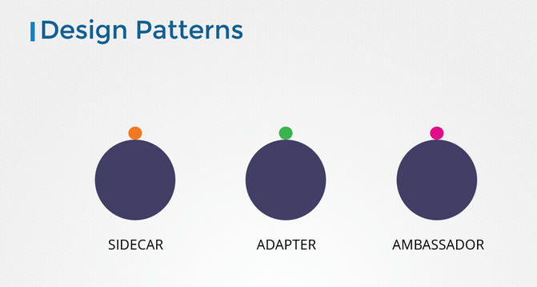

---

#### SideCar Container

#### ADAPTER Container

#### AMBASSADOR Container

## Pods in a Kubernetes cluster are used in two main ways

- Pods that run a single container.
  - The "one-container-per-Pod" model is the most common Kubernetes use case; in this case, you can think of a Pod as a wrapper around a single container; Kubernetes manages Pods rather than managing the containers directly.
- Pods that run multiple containers that need to work together.
  - A Pod can encapsulate an application composed of multiple co-located containers that are tightly coupled and need to share resources. These co-located containers form a single cohesive unit of service—for example, one container serving data stored in a shared volume to the public, while a separate **sidecar** container refreshes or updates those files. The Pod wraps these containers, storage resources, and an ephemeral network identity together as a single unit.

### [Init Containers](https://kubernetes.io/docs/concepts/workloads/pods/init-containers/)

- Init containers can contain **utilities or setup scripts** not present in an app image.
- You can specify init containers in the Pod specification alongside the containers array (which describes app containers).
- containers that run to completion during Pod initialization.
- init containers, which are run before the app containers are started.
- If a Pod's init container `fails`, the `kubelet` repeatedly restarts that init container until it succeeds.
- However, if the Pod has a `restartPolicy` of `Never`, and an init container fails during startup of that Pod, Kubernetes treats the overall Pod as failed.
- But at times you may want to run a process that runs to completion in a container.
  
**For example** a process that pulls a code or binary from a repository that will be used by the main web application. That is a task that will be run only  one time when the pod is first created. Or a process that waits  for an external service or database to be up before the actual application starts. That's where initContainers comes in.

Example 1:

```yml
    apiVersion: v1
    kind: Pod
    metadata:
      name: myapp-pod
      labels:
        app: myapp
    spec:
      containers:
      - name: myapp-container
        image: busybox:1.28
        command: ['sh', '-c', 'echo The app is running! && sleep 3600']
      initContainers:
      - name: init-myservice
        image: busybox
        command: ['sh', '-c', 'git clone <some-repository-that-will-be-used-by-application> ; done;']
```

**Init containers are exactly like regular containers, except:**

- Init containers always run to completion.
- Each init container must `complete successfully` before the next one starts.

### [Differences from regular containers](https://kubernetes.io/docs/concepts/workloads/pods/init-containers/#differences-from-regular-containers)

- Init containers support all the fields and features of app containers, including resource limits, volumes, and security settings
- the resource requests and limits for an init container are handled differently
- Regular init containers (in other words: excluding sidecar containers) do not support the lifecycle, livenessProbe, readinessProbe, or startupProbe fields.

### Differences in `init` and `Sidecar` cinatiner

**Init container**

- They run to completion before any application containers start within a pod.
- Their primary role is to set up the correct environment for the app to run.
- This may involve tasks like database migrations, configuration file creation, or permission setting.
- Once an init container has successfully completed its task, the app containers in the pod can start.
- init containers do not support lifecycle, livenessProbe, readinessProbe, or startupProbe
- Init containers share the same resources (CPU, memory, network) with the main application containers

 **Sidecar**

- They run alongside the main application container, providing additional capabilities like logging, monitoring, or data synchronization.
- Unlike init containers, sidecar containers remain running for the life of the pod.
- They are used to enhance or extend the functionality of the primary app container without altering the primary application code.
- For example, a logging sidecar might collect logs from the main container and forward them to a central log store.
- whereas sidecar containers support all these probes to control their lifecycle.

### Mutiple `Init` conatainers

- If you specify multiple init containers for a Pod, kubelet runs each init container sequentially
- Each init container must succeed before the next can run.
- When all of the init containers have run to completion, `kubelet` initializes the application containers for the Pod and runs them as usual.
- If any of the initContainers fail to complete, Kubernetes restarts the Pod repeatedly until the Init Container succeeds.
- if the pod fails to restart after sevral attemps then K8s gives up and pod goes into `crashloopbackoff` error.

Example 2:

```yml
    apiVersion: v1
    kind: Pod
    metadata:
      name: myapp-pod
      labels:
        app: myapp
    spec:
      containers:
      - name: myapp-container
        image: busybox:1.28
        command: ['sh', '-c', 'echo The app is running! && sleep 3600']
      initContainers:
      - name: init-myservice
        image: busybox:1.28
        command: ['sh', '-c', 'until nslookup myservice; do echo waiting for myservice; sleep 2; done;']
      - name: init-mydb
        image: busybox:1.28
        command: ['sh', '-c', 'until nslookup mydb; do echo waiting for mydb; sleep 2; done;']
```

```
NAME        READY     STATUS     RESTARTS   AGE
myapp-pod   0/1       Init:0/2   0          6m
```

# Cluster Maintenance

## OS upgrades and Patching of cluster

- We can drain the node on K8s cluster for which we want to patch
- this will make the node unschedulable and whatever pods present on the node will be terminated and created on some other node which part of the replica set.
- if the pods on the node which is supposed tobe drain is not a part of replicaset of replication controller or deamonSet then that node will note be able to drain because that pod will not created on other node. So for this we need to use the `--force` option.

**Command**

```
kubectl drain `node_name`
kubectl drain controlplane --ignore-daemonsets
kubectl drain controlplane --force --ignore-daemonsets # when the pod is present and not a part of replicaSet
```

- with drain you can **empty** node and make the node **unschedulable**
- after the pathing is done you can make the node normal by making it uncorden.

**Command**

```
kubectl uncordon `node_name`
```

- this will make the node schedulable. and the new pods will be spawned when the pods on the other node will be terminated or crashed.

**Command**

```
kubectl cordon 'node_name'
```

- This will cordon the node means this make the node unshedulable, But the pods which are already presnet on the node will not be evicted.
- **Taints** offer more granular control compared to cordoning

## Cluster Upgrade Process

- always the `kube-apiserver` will be one or two versions higher than other cluster components
- but the `kubectl` can be higher than `kube-apiserver`
- 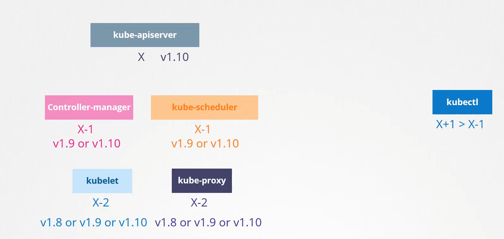
- whenever the new version of k8s is releases then the `X-3` version will be unsupported.
- recommended way of upgrading is upgrading minor versios
  - ex - `1.10 --> 1.11 --> 1.12 --> 1.13`
- you can easily upgrade the k8s version on managed k8s on cloud provider with just few clicks
- for `kubeadm` you can use the
  - `kubeadm upgrade plan`
  - `kubeadm upgrade apply`
    - in kubeadm upgrade the kublets are not upgraded you have to manually upgrade the kubelets
    - when you do `kubectl get node` it will only shows the versions of the kubelet on the master and worker nodes
- if you have deployed the k8s cluster from scratch then you need to upgrade each compomnents manually.

### Cluster upgrade strategy

- **Strategy-1**
  - upgrade the mastet node first this will not give downtime as the pods in the nodes are still serving the traffic
    - as the master is still upgrading the new pods on the Worker nodes will not be created as a part of `replicaSet`
  - upgrading all node at once this will have a downtime
- **Strategy-2**
  - Upgarding the master node fist this will not give downtime as the pods in the nodes are still serving the traffi
    - as the master is still upgrading the new pods on the Worker nodes will not be created as a part of `replicaSet`
  - Upgarding the node one by one, when a node is been taken down for upgrade the pods on the node will be creted on the different node which is running.

---

# Backup and Restore Methods

- **etcd** is the key-value store for kubernetes cluster
- **There are two way you can backup the cluster configurations**
  - querying the `kube-apiserver`
  - taking a snapshot.db of `etcd`
- You cannot backup the etcd in **managed** K8s cluster

## Backup `ETCD`

- `etcd` stores the state of the cluster
- rather than taking a backup of each individual resource, best way to take the backup of `ETCD database`
- for etcd the data is stored in the `data-dir=/var/lib/etcd`
- etcd comes with a built in snapshot solution
- to take the `etcd` backup first stop the kube-apiserver using `Service kube-apiserver stopped`

```
ETCDCTL_API=3 etcdctl \
    snapshot save snapshot.db
```

- to check the snapshot status

```
ETCDCTL_API=3 etcdctl \
    snapshot status snapshot.db
```

```
ETCDCTL_API=3 etcdctl \
    snapshot restore snapshot.db \
        --data-dir /var/lib/etcd-from-backup
```

- `systemctl daemon-reload`
- `service etcd restart`
- for authentication remember to provide the certs for `etcd`

```
ETCDCTL_API=3 etcdctl --endpoints=https://[127.0.0.1]:2379 \
--cacert=/etc/kubernetes/pki/etcd/ca.crt \
--cert=/etc/kubernetes/pki/etcd/server.crt \
--key=/etc/kubernetes/pki/etcd/server.key \
snapshot save /opt/snapshot-pre-boot.db
```

- if are using a managed k8s you wont be able to access or backup the `etcd`
- best way to query the `api-server`
- to query the `api-server` use the below command

```
kubectl get all --all-namespaces -o yaml > all-deploy-services.yml
```

### what is a `etcdctl`?

- `etcdctl` is a command-line tool for interacting with etcd, a distributed key-value store.
- `etcdctl` is used to:
  - Put, get, and delete keys from etcd
  - Watch for changes to keys
  - Manage etcd cluster membership
  - Perform maintenance tasks, such as defragmentation and compaction

```
etcdctl put <key> <value>
etcdctl get <key>
etcdctl del <key>
# Watches for changes to a key in etcd and prints the new value when it changes.
etcdctl watch <key>
# Manages etcd cluster membership
etcdctl member <subcommand>
```

# [Disaster Recovery for K8s](https://www.youtube.com/watch?v=qRPNuT080Hk)

# Security

- controlling the access to `kube-apiserver` you can control the authentication
  - **who can acess** and **what can they do**

**Who can access?**
`Authentication mechanism`

- Username and passwords in a file
- Username and Token in a file
- Certificates
- LDAP
- Service Accounts

**Authorization in K8s**

1. RBAC Authorization (Role based access control)
2. ABAC Authorization (Attibute based access control)
3. Node Authorization
4. Webhook Mode

All communication between varius master components are secure using the `TLS certificate`
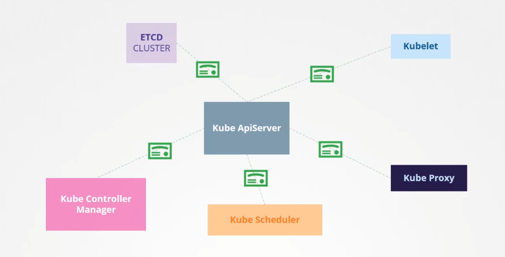

you can restricthe the communication between pods with `network policies`

## User Authentication in k8s cluster

- To Create a user in Kubernetes you need to create a `User.crt` and `User.key` and add it in the Kubernetes `Kubeconfig` file
- `User.crt` file must be signed by Kubernetes `CA authority`.
- User access the k8s cluster:
  - Admins
  - Developers
  - End users
  - bots
- K8s connot manage the Users natively
  - hence you cannot create or list user in k8s
- k8s relies on external user managment service like `LDAP`
- you can only manage the k8s service account
- all user access is managed by the `kube-apiserver`
- 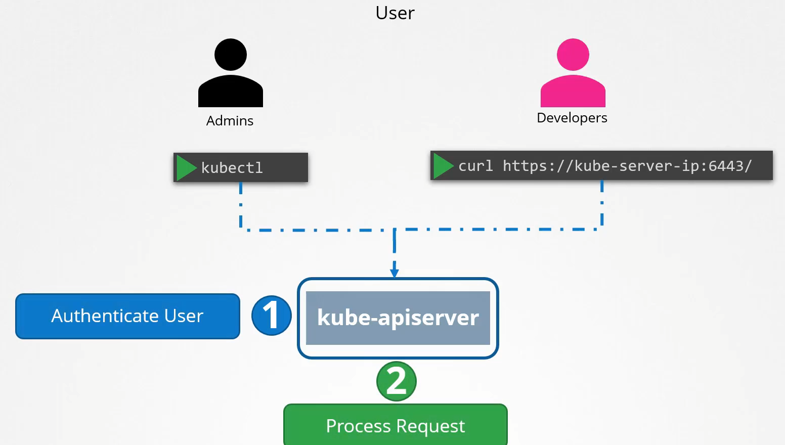
- Auth Mechanisam for `kube-apiserver`
  - Username and passwords in a csv file
    ```
    password123,username1,user_id1
    password456,username2,user_id2
    password789,username3,user_id3
    ```

    - `--basic-auth-file=user-details.csv`
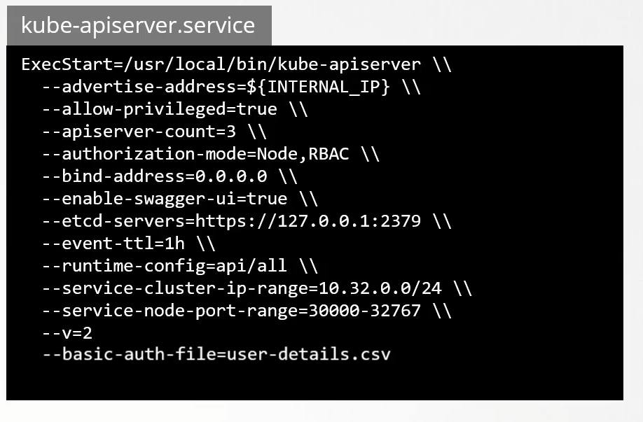

- Username and Token in a csv file
- Certificates
- LDAP
- Service Accounts

**Communication between Pods:**

- `Pods` are isolated from each other
- by default pod on any node can talk with any pod within a cluster.
- you can restrict this by setting up a network policy.

## TLS Certificate Authentication: (https://)

- **TLS Certification**is a cryptographic protocol designed to provide secure communication over a computer network. It ensures data privacy, integrity, and authentication between clients and servers.
- with the help of `https` there is no intervention between sender and recevier.
- `https` is an extension of `http`
- `RSA` is no longer support as a method for key exchange, it is replaced by [Diffie-Hellman algorithm](https://www.techtarget.com/searchsecurity/definition/Diffie-Hellman-key-exchange) for more secure key exchange method.

### Process

1. **Handshake Process:** `TLS Handshake`
   - **Client Hello:** The client sends a "Client Hello" message to the server, which includes the TLS version, cipher suites, and a randomly generated number.
   - **Server Hello:** The server responds with a "Server Hello" message, selecting the TLS version and cipher suite from the client's list, and provides a randomly generated number.
2. **Server Authentication and Pre-Master Secret:**
     - **Server Certificate:** The server sends its digital certificate to the client, which includes the server’s public key and is issued by a trusted `Certificate Authority (CA).`
     - **Pre-Master Secret:** The client generates a pre-master secret *encryption session key*, *encrypts it with the server’s public key*, and sends it to the server.
3. **Session Keys Creation:**
   - Both the client and the server use the`pre-master secret` along with the previously exchanged random numbers to generate the same session keys, which are symmetric keys used for the session’s encryption and decryption.
4. **Secure Communication:**
   - **Change Cipher Spec:** Both client and server send a message to indicate that future messages will be encrypted using the session keys.
   - **Encrypted Messages:** The client and server communicate securely using symmetric encryption.
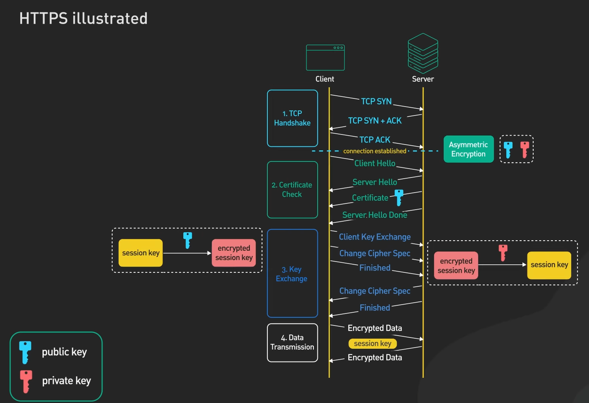

> The combination of TLS and Asystemtec provides a `robust` security framework, where TLS secures the communication channel and Asystemtec verifies user identities and manages sessions.

- **Symmentric Encryption**
   1. it is a secure way of encryption
   2. In symmetric key encryption, the same key is used for both encryption and decryption of data.
   3. encrypted data and key travells through same network
   4. hacker can intersept that key while sending and decrypt it.
   5. **faster** way of authentication

- **Asymmtric Encryption**
   1. Asymmetric encryption uses two mathematically connected keys: a **public** key and a **private** key.
      1. `ssh-keygen` to generate the private and public keys
   2. The **public** key is used for encryption of user data, while the **private** key is used for decryption of user data of the same server itself.
   3. Server send the public key to client
   4. client uses the public key to encrypt the private key of client
   5. client sends the encrypted private key to server
   6. server decrypts the encrypted key with its private key
   7. client encrypts the data with the clients public key
   8. client sends the encrypted data to server
   9. server decrypts the data with the clients private key which server recived earlier.
   10. Reads the data.
   11. Hacker can place its own proxy server in place of actual server
   12. then client communicates with that hacker server and hacks the data.s
  
- **TLS Handshake**
   1. `SSL/TLS` certs are created by CA authorities.
   2. Application server sends its public key to CA authority.
   3. CA authority issues a TLS certificate
   4. CA authority enclose the application server key init and give **signature** with CA authority server public key.
      1. `SIGNATURE = Application server public key + CA authority server public key`
      2. signature is then added in the certificate.
   5. Now that certificate from CA will be transfered to the application server with application server public key init.
   6. now the application server sends that signed certificate to the client server
   7. client server then recives the certificate from application server with application server public key init
   8. client server then goes to the CA authority of the application server and brings its public key.
   9. client then verify the SIGNATURE with public key if application server and Public key of CA authority.
   10. if the SIGNATURE matches then Client establish the connection with that application server, if not then connection is not been established.
   11. client uses that public key to encrypt the private key of client
   12. client send that encrypted private key of the client server to application server which was been encrypted by the public key of the application server.
   13. application server then drypt that client private key with application server private key, and stores that Client private key for that session.
   14. client encrypts the data with its public key and send to the application server
   15. application server recives that ecrypted data and drypt it with clients private key and reads the data.

## TLS certificate in Kubernetes Cluster

### Certificate and Key extensions

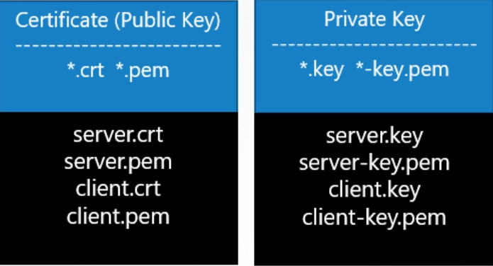

- TLS certificates are used to establish secure connection between the Master Node and Workers nodes or a System Admins is accessing the `kube-apiserver` with the help of `Kubectl`.
- kube-apiserver is itself act as server so need to be secure with `https` connection by the help of `TLS certificate` so it has its own `apiserver.crt` and `apiserver.key` .
- similarly `etcd-server` also has `etcdserver.crt` and `etcdserver.key`.
- Admin also requires the `admin.crt` and `admin.key` to access the `kube-apiserver`.
- similarly the `kube-scheduler` also talks with the `kube-apiserver` to schedule the pods on the worker nodes. So it also requires the TLS certificate and the key `scheduler.crt` and `scheduler.key`
- Even the Kube-apiserver requires the `apiserver.crt` and `apiserver.key` to talk to `etcd-server`
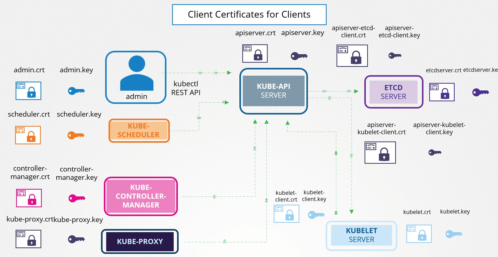

### How to generate the TLS certificate for k8s cluster

1. **Cluster Certificates**
   - **Generate the Private Key**
     - command = `openssl genrsa -out ca.key 2048`
   - **Generate the Certificate Signing Request (CSR)**
     - command = `openssl req -new -key ca.key -subj "/CN=KUBERNETES-CA" -out ca.csr`
   - **Sign Certificates**
     - command = `openssl x509 -req -in ca.csr -signkey ca.key -out ca.crt`
     - `ca.csr` is the cert with no sign
     - `ca.key` is used to sign the cert
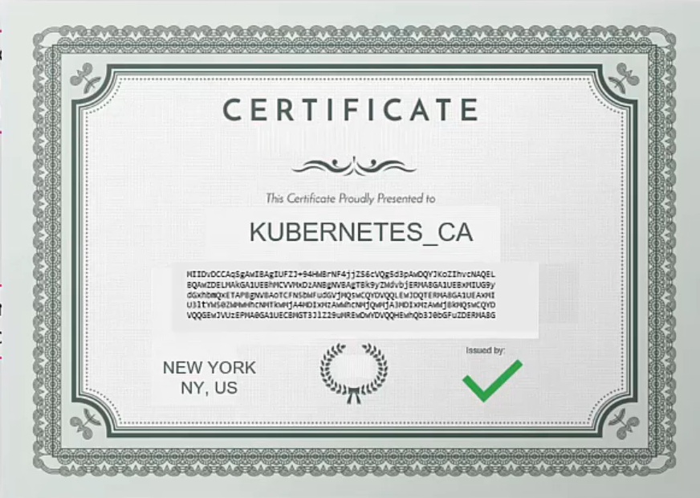
2. **Client Certificates**
   - **Generate the Private Key**
     - command = `openssl genrsa -out admin.key 2048`
   - **Generate the Certificate Signing Request (CSR)**
     - command = `openssl req -new -key admin.key -subj "/CN=KUBE-admin" -out admin.csr`
   - **Sign Certificates**
     - command = `openssl x509 -req -in admin.csr -signkey admin.key -out admin.crt`
     - `admin.csr` is the cert with no sign
     - `admin.key` is used to sign the cert
     - `admin.crt` is the final signed certificate

**To view all the certificates**

```
cat /etc/kubernetes/manifests/apiserver.yaml
```

## [KubeConfig](https://kubernetes.io/docs/tasks/access-application-cluster/configure-access-multiple-clusters/)
- To configure the user with the kubeAPI server you need to use the KubeAPI server.
-  Kubeconfig is a configuration file that contains the information about the **cluster**, **user** and the **authentication information (contexts)**.
-  It is located inside the `~/.kube/config`

**Clusters**
- Clusters have information about the different environments.
  - Development
  - UAT
  - Production


**Users**
-  Users have information about the different users.
-  Which user has access to the which cluster
   -  Admin user
   -  Dev user
   -  Prod user
-  These user may have different privileges to different cluster.
  
**Creating User in Kubernetes**
-  Kubernetes does not have a concept of users, instead it relies on certificates and would only trust certificates signed by its own CA.
- To get the CA certificates for our cluster, easiest way is to access the master node.
- Because we run on kind, our master node is a docker container.
- The CA certificates exists in the `/etc/kubernetes/pki` folder by default.
```
docker exec -it rbac-control-plane bash

ls -l /etc/kubernetes/pki
total 60
-rw-r--r-- 1 root root 1135 Sep 10 01:38 apiserver-etcd-client.crt
-rw------- 1 root root 1675 Sep 10 01:38 apiserver-etcd-client.key
-rw-r--r-- 1 root root 1143 Sep 10 01:38 apiserver-kubelet-client.crt
-rw------- 1 root root 1679 Sep 10 01:38 apiserver-kubelet-client.key
-rw-r--r-- 1 root root 1306 Sep 10 01:38 apiserver.crt
-rw------- 1 root root 1675 Sep 10 01:38 apiserver.key
-rw-r--r-- 1 root root 1066 Sep 10 01:38 ca.crt
-rw------- 1 root root 1675 Sep 10 01:38 ca.key
drwxr-xr-x 2 root root 4096 Sep 10 01:38 etcd
-rw-r--r-- 1 root root 1078 Sep 10 01:38 front-proxy-ca.crt
-rw------- 1 root root 1679 Sep 10 01:38 front-proxy-ca.key
-rw-r--r-- 1 root root 1103 Sep 10 01:38 front-proxy-client.crt
-rw------- 1 root root 1675 Sep 10 01:38 front-proxy-client.key
-rw------- 1 root root 1679 Sep 10 01:38 sa.key
-rw------- 1 root root  451 Sep 10 01:38 sa.pub

exit the container
```
```
cd kubernetes/rbac
docker cp rbac-control-plane:/etc/kubernetes/pki/ca.crt ca.crt
docker cp rbac-control-plane:/etc/kubernetes/pki/ca.key ca.key
```
- As mentioned before, Kubernetes has no concept of users, it trusts certificates that is signed by its CA.
This allows a lot of flexibility as Kubernetes lets you bring your own auth mechanisms, such as [OpenID](https://kubernetes.io/docs/reference/access-authn-authz/authentication/#openid-connect-tokens) Connect or OAuth.
- First thing we need to do is create a certificate signed by our Kubernetes CA.
- Easy way to create a cert is use openssl and the easiest way to get openssl is to simply run a container:
  ```
  docker run -it -v ${PWD}:/work -w /work -v ${HOME}:/root/ --net host alpine sh

  apk add openssl
  ```
- Let's create a certificate for `Bob Smith`:
  ```
  #start with a private key
  openssl genrsa -out bob.key 2048
  ```
Now we have a key, we need a certificate signing request (CSR).
We also need to specify the groups that Bob belongs to.
Let's pretend Bob is part of the Shopping team and will be developing applications for the Shopping
```
openssl req -new -key bob.key -out bob.csr -subj "/CN=Bob Smith/O=Shopping"
```
Use the CA to generate our certificate by signing our CSR.
We may set an expiry on our certificate as well
```
openssl x509 -req -in bob.csr -CA ca.crt -CAkey ca.key -CAcreateserial -out bob.crt -days 1
```
**Building a kube config**
Let's install kubectl in our container to make things easier:
```
apk add curl nano
curl -LO https://storage.googleapis.com/kubernetes-release/release/`curl -s https://storage.googleapis.com/kubernetes-release/release/stable.txt`/bin/linux/amd64/kubectl
chmod +x ./kubectl
mv ./kubectl /usr/local/bin/kubectl
```
We'll be trying to avoid messing with our current kubernetes config.
So lets tell kubectl to look at a new config that does not yet exists
```
export KUBECONFIG=~/.kube/new-config
```
Create a cluster entry which points to the cluster and contains the details of the CA certificate:
```
kubectl config set-cluster dev-cluster --server=https://127.0.0.1:52807 \
--certificate-authority=ca.crt \
--embed-certs=true

#see changes 
nano ~/.kube/new-config
```
```
kubectl config set-credentials bob --client-certificate=bob.crt --client-key=bob.key --embed-certs=true\
kubectl config set-context dev --cluster=dev-cluster --namespace=shopping --user=bob
kubectl config use-context dev
```
**Contexts**
- Contexts are use to link the user and cluster together.
-  It is used to switch between different cluster and user.
-  For example, you can have a context for the development cluster and another for the production cluster
-  use need to set the current context in the config file which tells the kubectl to which user to user for which cluster. 
-  you can also set the working namespace for a context

**To view the Kubeconfig**
- To view the config file   
   - `kubectl config view`
- To use a custom config file
  - `kubectl config view --kubeconfig=my-custom-config`
- To change the current context 
  - `kubectl config use-context <user@cluster>`
- To see only the configuration information associated with the current context, use the `--minify` flag.
  - `kubectl config --kubeconfig=config-demo view --minify`

**Example config file**
```yml
apiVersion: v1
kind: Config
current-context: user@cluster

clusters:
- name: development
  cluster:
      certificate-authority: ca.crt
      # to add ca.crt file content in base64 encoded format directly in config file
      # certificate-authority-data: 
      server: 0.0.0.0
- name: test
  cluster:
      certificate-authority: ca.crt
      server: 0.0.0.0

users:
- name: developer
  user:
      client-certificate: admin.crt
      client-key: admin.key
- name: experimenter
  user:
      client-certificate; admin.crt
      client-key: admin.key

contexts:
- name: developer@development
  context: 
      cluster: development
      user: developer 
      namespace: frontend
- name: experimenter@test
  context: 
      cluster: test
      user: experimenter
      namespace: storage
```

**Add context details to your configuration file:**
```
kubectl config --kubeconfig=config-demo set-context dev-frontend --cluster=development --namespace=frontend --user=developer
kubectl config --kubeconfig=config-demo set-context dev-storage --cluster=development --namespace=storage --user=developer
kubectl config --kubeconfig=config-demo set-context exp-test --cluster=test --namespace=default --user=experimenter
```
>**Note**:
A file that is used to configure access to a cluster is sometimes called a *kubeconfig file*. This is a generic way of referring to configuration files. It does not mean that there is a file named `kubeconfig`.

**Set the KUBECONFIG environment variable**
- Linux
  - `export KUBECONFIG_SAVED="$KUBECONFIG"`
- Append $HOME/.kube/config to your KUBECONFIG environment variable
  - `export KUBECONFIG="${KUBECONFIG}:${HOME}/.kube/config`"
- Windows PowerShell
  - `$Env:KUBECONFIG_SAVED=$ENV:KUBECONFIG`
  - `$Env:KUBECONFIG="$Env:KUBECONFIG;$HOME\.kube\config"`

## Kube API groups
- In Kubernetes, API groups are a way to organize different kinds of API resources, helping to make the API more modular and scalable. This approach allows the introduction of new APIs and versions without disturbing the core API, improving Kubernetes' extensibility. API groups essentially group related resources and provide versioning for these resources


**Structure of API Groups:**

`/apis/{group}/{version}/{resource}`

for Example:

`/apis/apps/v1/deployments`

- `apps` is the API group.
- `v1` is the API version.
- `deployments` is the resource being accessed.

### Types of API groups:
1. **Core Group (Legacy or No Group)** **(api)**
- Also known as the core or legacy API, this group doesn't have a name in the URL.
- The resources here are some of the core Kubernetes components, like **Pods**, **Services**, **Namespaces**, and **Nodes**.
- `/api/v1/pods`
---
2. **Named Groups** **(apis)**
- These are groups with names and are organized based on the functionality they serve.
- Each named group can have different versions (e.g., `v1`, `v2beta`, etc.), allowing backward compatibility and smooth transitions to newer versions.
- Examples:
- `apps`: This API group contains resources like **Deployments**, **DaemonSets**, and **StatefulSets**.
  - `/apis/apps/v1/deployments`
  
- `batch`: Handles jobs and cron jobs.
  - `/apis/batch/v1/jobs`

- `networking.k8s.io`: Deals with network-related resources like **Ingress** and **NetworkPolicies**.
  - `/apis/networking.k8s.io/v1/ingresses`

- `rbac.authorization.k8s.io`: Manages Role-Based Access Control (RBAC) resources like **Roles** and **RoleBindings**.
  - `/apis/rbac.authorization.k8s.io/v1/roles`
---
3. **Custom Resource Definitions (CRDs)**
- Kubernetes allows users to define their own APIs by creating `Custom Resource Definitions` (CRDs), which belong to custom groups and provide an extension to Kubernetes' built-in functionality.
- CRDs can be used to define resources in an organization-specific group.
- `/apis/custom.group/v1/myresource`
---
**Versioning in API Groups**

Kubernetes API groups use versioning (e.g., v1, v2beta1) to ensure backward compatibility.
Alpha versions (v1alpha1) are experimental and may change.
Beta versions (v1beta1) are more stable but can still undergo changes.
Stable versions (v1) are generally considered safe for production use.

---
**Summary of API Group Types:**

`Core Group`: No named group.

`Named Groups`: Feature-specific groups like apps, batch, networking.k8s.io, etc.

`Custom Groups (CRDs)`: User-defined API groups for extending Kubernetes functionality.

---

## [Authorizations](https://kubernetes.io/docs/reference/access-authn-authz/authorization/):
- Kubernetes authorization takes place following authentication. Usually, a client making a request must be authenticated (logged in) before its request can be allowed; however, Kubernetes also allows anonymous requests in some circumstances.
- All parts of an API request must be allowed by some `authorization mechanism` in order to proceed. In other words: access is denied by default.

## [Authorization modes](https://kubernetes.io/docs/reference/access-authn-authz/authorization/#authorization-modules)
1. RBAC
2. ABAC
3. Webhook
4. Node

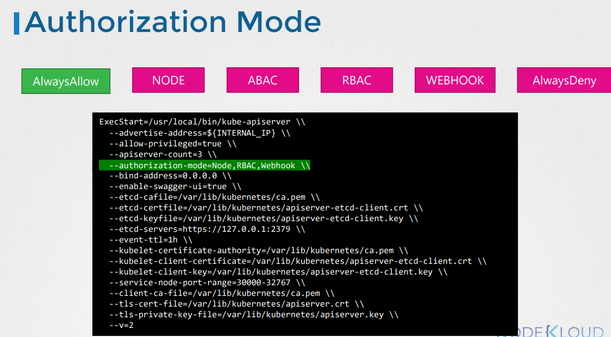
---
### RBAC (Role based access control)
- RBAC is the default authorization mode in Kubernetes.
- It is based on the concept of roles and bindings.
- Roles are collections of permissions.
- Bindings are used to assign roles to users or groups.
- in RBAC permissions are not assign directly to the user or group.
- `Role` and `RoleBinding` are namespace specific.
- A Role always sets permissions within a particular namespace; when you create a Role, you have to specify the namespace it belongs in.
- for cluster level you need to use the `ClusterRole`and `ClusterRoleBinding` which covers all namespaces.
- to check which Authorization modes are enabled on the cluster you can use the 
  - `kubectl describe pod kube-apiserver-controlplane -n kube-system | grep "--authorization-mode"` 

---


1. Define a `generic container` for permissions : a `Role`.
2. Assign the `permissions` to the `Role`.
3. Bind the `Role` to the `User` and `Group`.

---
- 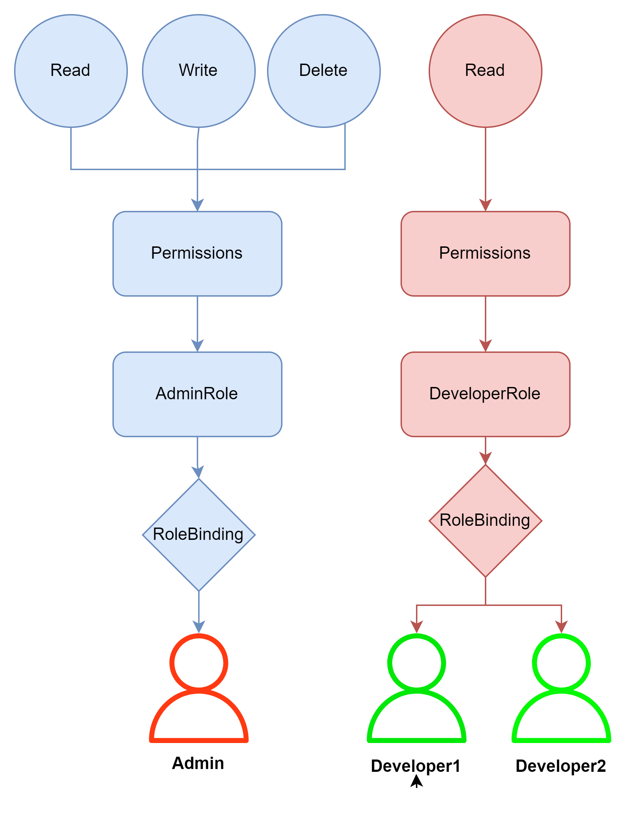
---

### Role and RoleBinding

**Example:**

```yml
apiVersion: rbac.authorization.k8s.io/v1
kind: Role
metadata:
  namespace: default
  name: pod-reader
rules:
- apiGroups: [""] # "" indicates the core API group
  resources: ["pods"]
  verbs: ["get", "watch", "list"]
```

To link the User to the `Role` we need to use the `RoleBinding`.

```yml
apiVersion: rbac.authorization.k8s.io/v1
# This role binding allows "jane" to read pods in the "default" namespace.
# You need to already have a Role named "pod-reader" in that namespace.
kind: RoleBinding
metadata:
  name: read-pods
  namespace: default
subjects:
# You can specify more than one "subject"
- kind: User
  name: jane # "name" is case sensitive
  apiGroup: rbac.authorization.k8s.io
roleRef:
  # "roleRef" specifies the binding to a Role / ClusterRole
  kind: Role #this must be Role or ClusterRole
  name: pod-reader # this must match the name of the Role or ClusterRole you wish to bind to
  apiGroup: rbac.authorization.k8s.io
```

- RoleBinding also operates on the `namespace` level.

**commands**
- `kubectl get roles` to list all roles in the current namespace
- `kubectl get rolebindings` 
- `kubectl describe role <role_name>`

**Check acess**

To see if the use has the access to a perticuler resource in the cluster

- kubectl auth `can-i` create deployment ----> yes
- kubectl auth `can-i` delete nodes ------> no
- kubectl auth `can-i` create deployment --as `dev-user` ----> no
- kubectl auth `can-i` create pods --as `dev-user` -----> yes
- kubectl auth `can-i` create pods --as `dev-user` --namespace test ----> no
---

### ClusterRole and ClusterRoleBindings
- `ClusterRole` and `ClusterRoleBindings` are used to manage access at the cluster level. They are similar to `Role` and `RoleBindings`.
- with the help of CLusterRole the `user` can access the `resources` of other namespaces too.
- *Use-cases*
  - **Node**
    - delete Node
    - Create Node
    - update Node
  - **Storage**
    - delete PV
    - Create PV
    - update PV

**Namespaced Resources**
- Role
- RoleBindings
- Deployments
- Pods
- ReplicaSets
- ConfigMaps
- Secretes
- Services
- PVC
- Jobs

**Cluster Scoped Resources**
- ClusterRole
- ClusterRoleBindings
- PV
- nodes
- CertificateSingningRequests
- namespaces

```yml
apiVersion: rbac.authorization.k8s.io/v1
kind: ClusterRole
metadata:
  # "namespace" omitted since ClusterRoles are not namespaced
  name: secret-reader
rules:
- apiGroups: [""]
  #
  # at the HTTP level, the name of the resource for accessing Secret
  # objects is "secrets"
  resources: ["secrets"]
  verbs: ["get", "watch", "list"]
```

```yml
apiVersion: rbac.authorization.k8s.io/v1
# This cluster role binding allows anyone in the "manager" group to read secrets in any namespace.
kind: ClusterRoleBinding
metadata:
  name: read-secrets-global
subjects:
- kind: Group
  name: manager # Name is case sensitive
  apiGroup: rbac.authorization.k8s.io
roleRef:
  kind: ClusterRole
  name: secret-reader
  apiGroup: rbac.authorization.k8s.io
```

---


###  [ServiceAccounts](https://kubernetes.io/docs/concepts/security/service-accounts/) 

- ServiceAccount is used when an application want to connect or retrieve data from the cluster
	- Authenticating to the API server or implementing identity-based security policies.
- **There are two types of accounts in k8s:**
	- **User Account**
		- used by users 
		- admin access the cluster to administer the cluster
		- developer access the cluster to deploy the application 
		- By default, user accounts don't exist in the Kubernetes API server; instead, the API server treats user identities as `opaque` data.
	- **Service Accounts** 
		- Used by machines
- When a service account is created it two objects. 
	- the Service Account object
		- `kubectl describe serviceaccount <name>`
	- Secret object to store the token init.
		- `kubectl describe secret <token_name>`
- Then the Secret object is linked to the service account
- **Process**
	1. Create a SA `kubectl create sa <SA_name>`
	2. Export the token `kubectl create token <SA_name>`
		1. Token path: `/var/run/secrets/kubernetes.io/serviceaccount`
	3. Assign right permissions with (**RBAC**) 
		1. Create Role
		2. Create RoleBindings
	4. Attach the `SA` to `POD` using `serviceAccountName` field
	5. for checking permissions use below command 
		1. `kubectl auth can-i get pod --as=system:serviceaccount:default:<SA_name>`
- Each `NameSpace` has its own default `service account`
- When you create a cluster, Kubernetes automatically creates a ServiceAccount object named `default` for every namespace in your cluster. it has `no permission` by default 
- whenever a new pod is created the default `service Account` and its token automatically gets mounted as a volume inside the pod
- if you don't mention the `service Account` name a default gets automatically mounted as a  volume mount inside the pod
- To prevent Kubernetes from automatically injecting credentials for a specified ServiceAccount or the `default` ServiceAccount, set the `automountServiceAccountToken` field in your Pod specification to `false`.
>**Note**: After Kubernetes version `1.24` the token has expiration time 

```yml
apiVersion: v1
kind: ServiceAccount
metadata:
  annotations:
    kubernetes.io/enforce-mountable-secrets: "true"
  name: my-serviceaccount
  namespace: my-namespace
```

```yml
apiVersion: rbac.authorization.k8s.io/v1
kind: Role
metadata:
  namespace: default
  name: pod-reader-SA
rules:
- apiGroups: [""] # "" indicates the core API group
  resources: ["pods"]
  verbs: ["get", "watch", "list"
```

```yml
apiVersion: rbac.authorization.k8s.io/v1
kind: RoleBinding
metadata:
  name: read-pods
  namespace: default
subjects:
- kind: ServiceAccount
  name: my-serviceaccount 
  namespace: default
roleRef:
  kind: Role 
  name: pod-reader-SA
  apiGroup: rbac.authorization.k8s.io
```

```yml
---
apiVersion: v1
kind: Pod
metadata:
  name: frontend
spec:
  serviceAccountName: my-serviceaccount
  containers:
  - name: nginx
    image: nginx
    command: ["sleep", "5000"]
```

To remove the `default` SA from pod
```yml
---
apiVersion: v1
kind: Pod
metadata:
  name: frontend
spec:
  automountServiceAccountToken: false # To do not use the default SA
  containers:
  - name: nginx
    image: nginx
    command: ["sleep", "5000"]
```
---
## [Image Security](https://kubernetes.io/docs/tasks/configure-pod-container/pull-image-private-registry/)
- to connect to private container registry other than docker
- image: `registry_url/user_Account/Image_repo`
  - 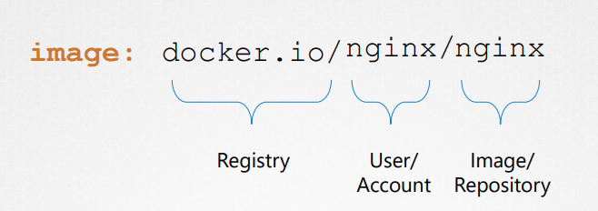
- to authenticate to the private docker register you need to create a secret
```
kubectl create secret docker-registry docker-creds \ 
--docker-server= private-registry.io \ 
--docker-username= registry-user \ 
--docker-password= registry-password \ 
--docker-email= registry-user@org.com
```
```yml
apiVersion: v1
kind: Secret
metadata:
  name: docker-registry
type: kubernetes.io/dockerconfigjson
data:
  docker-server: gcr.io
  docker-username: xyz
  docker-password: password
  docker-email: xyz@mail.com
```

- Attach the `secret` to the `pod` with `imagePullSecrets` field in pod definition 
```yml
---
apiVersion: v1
kind: Pod
metadata:
  name: frontend
spec:
  containers:
  - name: registry_url/user_Account/Image_repo # give full image Name
    image: nginx
    command: ["sleep", "5000"]
  imagePullSecrets:
  - docker-registry
```
---

## Docker Security
- container and host share the same kernel
- All the process run by the container are ran on the host itself but in there own namespace
- Process of containers are isolated from each other
- by default the docker run process as  a root user inside the container
	- you can choose the `user` while running the container ex- `user 1000`
- use can build a `Dockerfile` with `user 1000` then any process docker run inside the docker container will be run as  a `user 1000`


```Dockerfile
FROM ubuntu
USER 1000
```


```
docker run my-ubuntu-image sleep 3600 # this will run the sleep command as a USER 1000 not the ROOT inside the container 
```

- `ROOT` user within the container is not as good as the `ROOT` user in the host
	- Docker host doesn't have the privilege to reboot the host
	- **`docker run --cap-add MAC_ADMIN ubuntu`** : This option adds a specific capability to the container.
		- **`MAC_ADMIN`** stands for Mandatory Access Control (MAC) administration. This capability allows the container to modify or administer MAC policies. Such policies control access to system resources, enforcing security boundaries.
		- *Note*: Granting the `MAC_ADMIN` capability should be done carefully, as it gives the container additional privileges, potentially increasing security risks.
	- **`docker run --cap-drop KILL ubuntu`** : This option removes a specific capability from the container.
		- **`KILL` capability**: Normally, this capability allows processes within the container to send signals to other processes (e.g., to terminate them). By dropping it, you prevent processes within the container from sending signals to terminate other processes (unless they own the processes).
		- **Security Context**: Dropping capabilities like `KILL` is part of a security best practice called the "principle of least privilege." By reducing the container's privileges, you minimize the risk of it being used to compromise the system.
	- **`docker run --priviledge ubuntu`** : This flag grants the container almost all the host’s kernel capabilities. Specifically
		- The container has access to all devices on the host, allowing it to perform operations that are usually restricted.
		- The container can change certain settings and modify system configurations, which are typically protected (e.g., mount filesystems, change kernel parameters).
		- It bypasses many of Docker's usual isolation mechanisms, essentially giving the container root access to the host machine’s kernel and hardware.
	>**Note**: **Security Risk**: Running a container with the `--privileged` flag is risky because it grants nearly unrestricted access to the `host` system. This should only be used in trusted environments or when absolutely necessary, such as in cases requiring direct hardware access (e.g., for containers managing low-level system operations or running software that needs kernel-level permissions).
---
## Docker security Context in Kubernetes:
- To Implement the docker like capabilities via k8s
- to apply at `pod` level add `securityContext` field
```yml
---
apiVersion: v1
kind: Pod
metadata:
  name: frontend
spec:
  securityContext:
    runAsUser: 1000
  containers:
  - name: ubuntu_conatiner
    image: ubuntu
    command: ["sleep", "3600"]
```
To apply capabilities at `container` level inside the pod
```yml
---
apiVersion: v1
kind: Pod
metadata:
  name: frontend
spec:
  containers:
  - name: ubuntu_conatiner
    image: ubuntu
    command: ["sleep", "3600"]
    securityContext:
      runAsUser: 1000
      capabilities:
        add: ["MAC_ADMIN"]
```

>**Note**: Capabilities cannot be added at the `POD` level it can be only added at the `container` level

```yml
apiVersion: v1
kind: Pod
metadata:
  name: multi-pod
spec:
  securityContext:
    runAsUser: 1001
  containers:
  -  image: ubuntu
     name: web
     command: ["sleep", "5000"] # This command will run as USER 1002
     securityContext:
      runAsUser: 1002

  -  image: ubuntu
     name: sidecar
     command: ["sleep", "5000"] # This command will run as USER 1001
```
---
## [Network Policy](https://earthly.dev/blog/kubernetes-network-policies/)
- you can only use the `NetworkPolicy` object in k8s when you have deployed a Networking solution inside the cluster.
  - **Antrea**
    - calico
    - cilium
  - **kube-router**
    - Romana
    - Weave-net
- If you want to control traffic flow at the IP address or port level (OSI layer 3 or 4), NetworkPolicies allow you to specify rules for traffic flow within your cluster, and also between Pods and the outside world.
- Your cluster must use a network plugin that supports `NetworkPolicy` enforcement.
- by default any pod in any node within cluster can communicates with any pod.
- With Network policies attached to a pod you can control the ingress(incomming) and egress(Outgoing) traffic from a pod.
**User Case**
- Suppose we have a 3-tier application
	- front-end
	- back-end
	- Database
- we want only back-end pod can communicates with the database pod, not the front-end pod
- we can achive this with the help of `Network policy` object in K8s.

[Network](https://earthly.dev/blog/assets/images/kubernetes-network-policies/T9DWs2n.png)
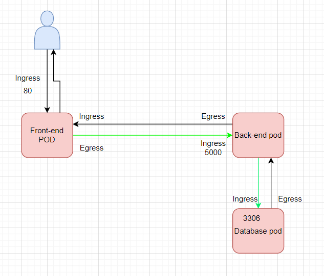 

**FEATURES OF NETWORK POLICIES**
- **Namespaced resources:** Network policies are defined as Kubernetes objects and are applied to a specific namespace. This allows you to control traffic flow between pods in different namespaces.
- **Additive:** In Kubernetes, network policies are additive. This means that if you create multiple policies that select the same pod, all the rules specified in each policy will be combined and applied to the pod.
- **Label-based traffic selection:** Kubernetes network policies allow you to select traffic based on pod labels. This provides a flexible way to control traffic flow within your cluster.
- **Protocol and port selection:** You can use network policies to specify which protocols (TCP-UDP-SCTP) and ports are allowed for incoming and outgoing traffic. This helps to ensure that only authorized traffic is allowed between pods.
- **Integration with network plugins:** Kubernetes network policies are implemented by network plugins. This allows you to use the network plugin of your choice and take advantage of its features and capabilities.

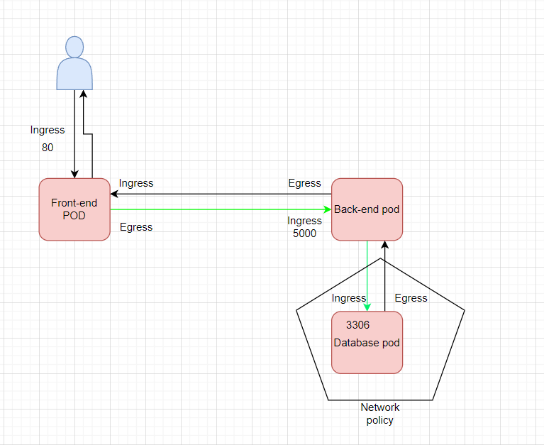


Create a pod `database` with `labels` 

```yml
apiVersion: v1
kind: Pod
metadata:
  name: database-pod
  labels:
    app: database
spec:
  containers:
  -  image: mysql
     name: database-pod
     command: ["sleep", "5000"]
```

```yml
apiVersion: networking.k8s.io/v1
kind: NetworkPolicy
metadata:
  name: database-pod-NP
spec:
  podSelector:
    matchLabels:
      app: database
  policyTypes:
    - Ingress
  ingress:
    - from:
        - podSelector:
            matchLabels:
              app: back-end
      ports:
        - protocol: TCP
          port: 3306
```

Now to enable the traffic from another `namespace`, below will allow traffic from `back-end` pod from `prod` namespace to `database` pod
```yml
apiVersion: networking.k8s.io/v1
kind: NetworkPolicy
metadata:
  name: database-pod-NP
spec:
  podSelector:
    matchLabels:
      app: database
  policyTypes:
    - Ingress
  ingress:
    - from:
        - podSelector:
            matchLabels:
              app: back-end
        - namespaceSelector:
            matchLabels:
              ns: prod
      ports:
        - protocol: TCP
          port: 3306
```

To control the outgoing traffic `engress` from the `database` pod to the `back-end` pod
```yml
apiVersion: networking.k8s.io/v1
kind: NetworkPolicy
metadata:
  name: database-pod-NP
spec:
  podSelector:
    matchLabels:
      app: database
  policyTypes:
    - Ingress
    - Egress
  ingress:
    - from:
        - podSelector:
            matchLabels:
              app: back-end
        - namespaceSelector:
            matchLabels:
              env: prod
      ports:
        - protocol: TCP
          port: 3306
  
  engress:
    - to:
        - podSelector:
            matchLabels:
              app: back-end
        - namespaceSelector:
            matchLabels:
              ns: prod
      ports:
        - protocol: TCP
          port: 3303
```

to add external server to connect to the database pod, then you need to allow that server IP
```yml
apiVersion: networking.k8s.io/v1
kind: NetworkPolicy
metadata:
  name: database-pod-NP
spec:
  podSelector:
    matchLabels:
      app: database
  policyTypes:
    - Ingress
    - Egress
  ingress:
    - from:
        - ipBlock:
            cidr: 172.17.0.0/16 # add range of Ip address
            except:
              - 172.17.1.0/24
      ports:
        - protocol: TCP
          port: 6875
```
---
### **Kubectx**:

With this tool, you don't have to make use of lengthy “kubectl config” commands to switch between contexts. This tool is particularly useful to switch context between clusters in a multi-cluster environment.

**Installation**:
```
sudo git clone https://github.com/ahmetb/kubectx /opt/kubectx
sudo ln -s /opt/kubectx/kubectx /usr/local/bin/kubectx
```
**Syntax**:

To list all contexts:

```
kubectx
```


To switch to a new context:
```
kubectx <context_name>
```

To switch back to previous context:
```
kubectx -
```


To see current context:
```
kubectx -c
```
---
### **Kubens**:

This tool allows users to switch between namespaces quickly with a simple command.

**Installation**:
```
sudo git clone https://github.com/ahmetb/kubectx /opt/kubectx
sudo ln -s /opt/kubectx/kubens /usr/local/bin/kubens
```
**Syntax**:

To switch to a new namespace:
```
kubens <new_namespace>
```

To switch back to previous namespace:
```
kubens -
```
---
# Storage in Kubernetes

## Storge in Docker:
- **Docker File system in host:**
  - by default docker stores data in host at
  - Images are stored in images folder
  - container data is stored in container folder
  - volumes in volumes folder
    ```shell
    /var/lib/docker
        aufs
        containers
        image
        volumes
    ```

- **Docker layer archetrcutre:**
  - each instruction in docker file has its own layer
  - If the some of the layers is already used by the some other docker file previously then docker will not create the same layer again it will reuse it
    - this will save Docker image build time
    -  this will save Docker image size
 -  **type of layers in docker**
    -  *Image layer*
       -  This is a `readOnly` layer, where user cannot modify the containts of it.
       -  if you want to modify let say application source code then docker will automatically creates the copy of it from the image layer to the container layer where you can be able to modify it.
    -  *Container layer*
       -  This layer can be modify `read-write` by the user
       -  container layer is temp layer and only created when the container is created and deleted when the container is bing deleted.
    -  Once the image is created its layers are been shared by other images too.
    -  Once the container is deleted the data which is been changed also been deleted, to persists data we need to use the docker volmes.
- **Docker Volumes**
  - *Volume Mount*
    - with volume mount you can mount the volume in host with inside the file directory in docker container
    - Even if the container gets deleted the data still remains inside the volume in the host.
      ```
      docker create volume volume1
      docker run -v volume1:/app myimage
      ```
  - *Bind Mount*
    - Now suppose you want to mount a directory of host to the directory of container you can achive this with the help of Bind mount
      ```
      docker run -v /temp/app:/app myimage
      docker run --mount type=bind,source=/data/mysql,target=/var/lib/mysql mysql
      ```
- **Storage Drivers**
  - Docker automatically choose the Storage drive based on OS.
  -  Docker supports multiple storage drivers
     -  AUFS
     -  ZFS
     -  BTRFS
     -  Device Mapper
     -  Overlay
     -  Overlay2
---
## Docker Volumes
- **Docker Volumes** are used to persist data even after the container is deleted.
- You can use the Volume Drive to presist the data to AWS, GCP or Azure.
  - local
  - Azure file Storage
  - Convoy
  - Digital Ocean Block Storage
  - NetApp
  - etc.
  ```
  docker run -it --name mysql --volume-driver rexray/ebs --mount src=ebs-vol,target=/var/lib/mysql mysql
  ```
  - this will provsion a AWS EBS to store the data from the Docker container volume to Cloud.

## Kubernetes interfaces standards for any container technology:
- CRI - Container Runtime Interface
- CNI - Container Network Interface
- CSI - Container Storage Interface

## PersistantVolume (Refer above)
## PersistentVolumeClaim (Refer above)